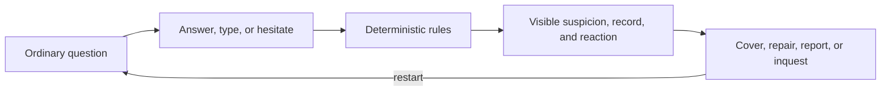

# Dream of One

> **The society investigates you.**

[](https://godotengine.org/)


Dream of One is a 2D top-down conversation social-stealth game set in a
stateless administered district. Ordinary questions become small
interrogations: what you say, type, or leave unanswered can become a record,
and that record can follow you from the Store to the Station.

The player is never the investigator. The society investigates the player.


*The current Same Order slice: a risky answer raises suspicion and report
pressure, exposes a why-line, and changes the clerk's next question.*

## Playable now

The active M1 build plays end to end through the **Same Order (같은 주문)**
storylet:

- Explore a 2D Store and the Station intake room with a resizable pixel-art
  presentation.
- Answer with three dialogue choices, a bounded typed statement, or silence;
  six seconds of hesitation is itself recorded as an answer.
- Inspect NPCs and record props, open the civic ledger, and see why suspicion
  or report pressure changed.
- Reach four deterministic outcomes: **clean cover**, **repair recovery**,
  **soft report**, and **hard inquest**.
- Restart immediately and test a different line.

The default build replays committed, backend-generated fixture data, so it is
fully playable without Bun or a live AI provider. The same four routes
also pass against the localhost TypeScript sidecar. M1 remains active until
its manual fun-gate and acceptance closeout are recorded.

## Play

### Requirements

- Godot **4.7.x stable**

Set `GODOT_BIN` to the Godot executable for your machine, then launch the
project from the repository root:

```bash
export GODOT_BIN="/absolute/path/to/Godot"
"${GODOT_BIN:?set GODOT_BIN to the local Godot CLI}" --path godot
```

The game opens in deterministic fixture mode. Walk to the Store clerk and
press `E` or `Space` to begin.

### Controls

| Action | Keyboard / mouse |
| --- | --- |
| Move | `WASD` or arrow keys |
| Interact / inspect | `E` or `Space` |
| Choose a response | Click, `1`–`3`, or focus with `↑`/`↓` and press `Enter` |
| Submit a typed statement | Type, then press `Enter` or click **기록** |
| Open the ledger | `Tab` |
| Close conversation / inspection | `Esc` (`E` also closes inspection) |
| Restart after an outcome | `Enter` or click **다시 시작** |

## The conversation loop



Every consequence after the player's answer is deterministic. Each suspicion
change carries a visible why-line; terminal outcomes cite the exact ledger
entries that produced them.

| Route | What the player does | What the world does |
| --- | --- | --- |
| **Clean cover · 무사 통과** | Stays consistent | Leaves no adverse record |
| **Repair · 수습** | Slips, then repairs | Attaches a correction; no report |
| **Soft report · 약식 보고** | Leaves signals unresolved | Forwards a report |
| **Hard inquest · 심문** | Contradicts a record | Cites it at the Station |


*A hard-inquest outcome names the authority action and the three ledger entries
used to open the formal inquiry.*

## How the build is split

| Layer | Owns | Does not own |
| --- | --- | --- |
| **Godot client** | World, input, HUD | Rules and verdicts |
| **TypeScript runtime** | Session rules and records | Rendering |
| **Provider ports** | Future wording and tool proposals | Authority |

M1 is deterministic-only: it makes no live LLM calls. Live provider wording is
planned for M2, and NPCs that iterate through visible agent loops are planned
for M3. See the [architecture](docs/tech/architecture.md) and
[roadmap](docs/plan/roadmap.md) for those boundaries.

## Development

Bun **1.3.14+** is required only for runtime development and localhost HTTP
mode. From the repository root:

```bash
bun install --cwd backend/npc-runtime --frozen-lockfile
bun run --cwd backend/npc-runtime check

"$GODOT_BIN" --headless --import --path godot
"$GODOT_BIN" --headless --path godot --script res://tools/scene_load_smoke.gd
"$GODOT_BIN" --headless --path godot --script res://tools/route_smoke.gd
```

### Run against the localhost sidecar

Start the deterministic runtime in one terminal:

```bash
PORT=18787 bun run --cwd backend/npc-runtime serve
```

Then launch the Godot client in HTTP mode from another:

```bash
DREAM_SESSION_MODE=http \
DREAM_SESSION_URL=http://127.0.0.1:18787 \
"$GODOT_BIN" --path godot
```

The automated live parity check starts and stops its own sidecar:

```bash
GODOT_BIN="$GODOT_BIN" backend/npc-runtime/scripts/live-route-parity.sh
```

The full check list and test policy live in
[`docs/tech/verification.md`](docs/tech/verification.md).

## Repository map

| Path | Purpose |
| --- | --- |
| [Godot client](godot/) | 2D scenes, scripts, assets, and smoke tools |
| [NPC runtime](backend/npc-runtime/) | Deterministic sessions and HTTP API |
| [Documentation](docs/) | Direction, design, art, architecture, and plans |
| [Scenario canon](docs/scenario/) | Korean storylets and dialogue |
| [Runtime artifacts](data/evidence/) | Historical and generated check output |

## Documentation

| Start here for… | Document |
| --- | --- |
| The one-sentence pitch and player fantasy | [Pitch](docs/vision/pitch.md) |
| The playable conversation and route rules | [Core loop](docs/game/core-loop.md) |
| The active implementation milestone | [M1: 2D playable slice](docs/plan/m1-2d-playable-slice.md) |
| The Godot / runtime authority boundary | [Architecture](docs/tech/architecture.md) |
| Every active project document | [Documentation index](docs/README.md) |
| Local contribution and commit workflow | [Contributing](CONTRIBUTING.md) |
| Why the previous 3D iteration was retired | [v1 postmortem](docs/history/v1-postmortem.md) |

## License and assets

No top-level code license has been declared yet. Third-party art follows the
[asset pipeline](docs/art/asset-pipeline.md): committed assets are CC0 or
project-owned, while redistribution-restricted packs remain local and are
never pushed to this public repository. Attribution details are in
[`docs/art/CREDITS.md`](docs/art/CREDITS.md).
