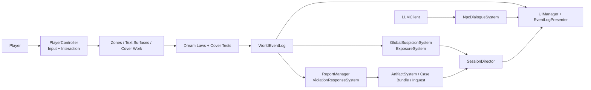
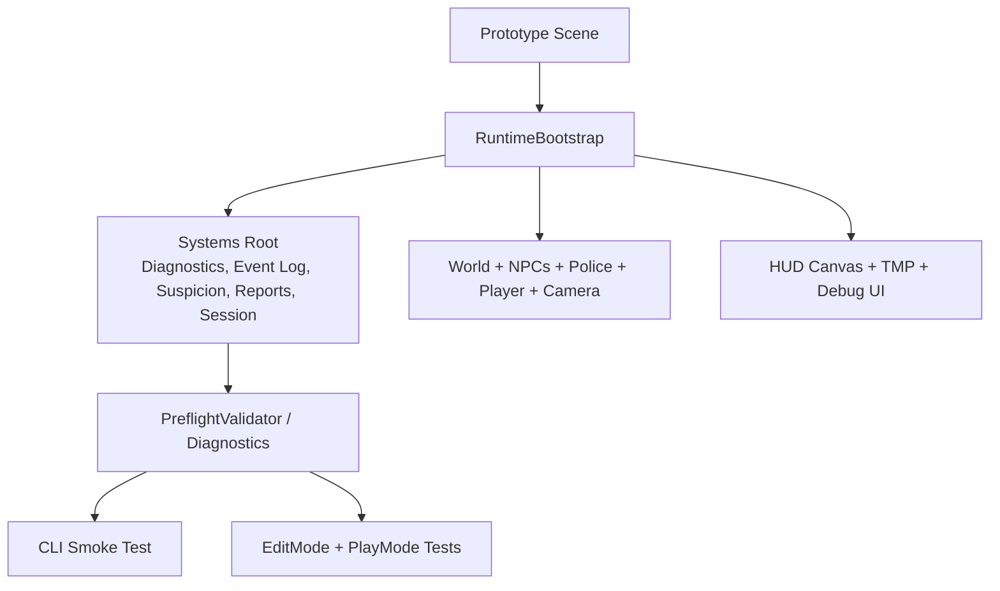

# Dream of One

Dream of One is a Unity 6 social-stealth prototype about staying procedurally normal under institutional scrutiny. The active playable code lives in the Unity project at the repository root. The earlier Mineflayer + TypeScript runtime is preserved as an archive under `deprecated/mineflayer/`.

## Repository Status

- Active implementation: Unity 6 (`6000.3.11f1`) project at the repository root
- Active scene: `Assets/Scenes/Prototype.unity`
- Active runtime stack: URP, Input System, TextMesh Pro, runtime bootstrap, EditMode tests, PlayMode tests
- Historical archive: `deprecated/mineflayer/` and `docs/deprecated/mineflayer/`

## Core Loop

- The player moves through a compact social space and performs cover work.
- Dream Laws and Cover Tests convert suspicious behavior into structured violations.
- NPC systems gossip, report, collect Evidence, and escalate toward a verdict.
- The session ends as `Clean Pass`, `Narrow Escape`, or `Exposed`.
- Dialogue can run in mock mode, through a local endpoint, or through OpenAI Chat Completions.

## Runtime Overview



## Bootstrap And Validation Flow



## What Is Implemented

### Gameplay systems

- Runtime bootstrap that can assemble a minimal playable world when required
- Social-pressure loop built around `DreamLaw*`, `CoverTest*`, reports, artifacts, and verdict generation
- Player movement, interaction, camera control, and cover-status tracking
- Session progression, carryover rules, and readable end-of-run summaries
- HUD and debug overlays for suspicion, Evidence, prompts, artifacts, and session state

### AI and dialogue

- `LLMClient` supports `Mock`, `LocalEndpoint`, and `OpenAIChatCompletions`
- Local endpoint defaults to `http://localhost:11434/utterance`
- Local runs automatically raise timeout to a safer floor for local models
- NPC dialogue remains optional; diagnostics warn when dialogue systems are absent

### Verification surfaces

- Menu-driven diagnostics through `Tools/DreamOfOne/Run Diagnostics`
- CLI diagnostics and smoke entrypoints through `DreamOfOne.Editor.CLIRunner`
- EditMode coverage in `Assets/Tests/EditMode/`
- PlayMode coverage in `Assets/Tests/PlayMode/`

## Quick Start

### Requirements

- Unity `6000.3.11f1`
- Input System package enabled
- URP packages resolved

### Open and play

1. Open the repository root in Unity Hub with Unity `6000.3.11f1`.
2. Open `Assets/Scenes/Prototype.unity`.
3. Press Play.

If the scene is sparse or partially rebuilt, `RuntimeBootstrap` will create the minimum runtime objects needed for a playable loop.

## Default Controls

- Move: `W`, `A`, `S`, `D`
- Jump: `Space`
- Interact: `E`
- Photo / evidence action: `F`
- Camera orbit: right mouse drag
- Camera orbit fallback: arrow keys
- Zoom: mouse wheel
- Camera distance presets: `1`, `2`, `3`
- Snap camera behind player: `R`
- Toggle log: `L`
- Inspect artifact panel: `I`
- Toggle debug overlay: `F1`
- Toggle case panel: `C`
- Cycle case filter: `V`

## Verification

### Editor menu

- Run `Tools/DreamOfOne/Run Diagnostics`.

### Unity CLI

Set `UNITY_PATH` to your editor binary, then run:

```bash
"$UNITY_PATH" \
  -batchmode \
  -projectPath "$(pwd)" \
  -executeMethod DreamOfOne.Editor.CLIRunner.RunEditorDiagnostics \
  -logFile Logs/editor-diagnostics.log \
  -quit
```

```bash
"$UNITY_PATH" \
  -batchmode \
  -projectPath "$(pwd)" \
  -executeMethod DreamOfOne.Editor.CLIRunner.RunPlaymodeSmokeTest \
  -logFile Logs/playmode-smoke.log \
  -quit
```

```bash
"$UNITY_PATH" \
  -batchmode \
  -projectPath "$(pwd)" \
  -runTests \
  -testPlatform EditMode \
  -testResults Logs/editmode-tests.xml \
  -logFile Logs/editmode-tests.log \
  -quit
```

```bash
"$UNITY_PATH" \
  -batchmode \
  -projectPath "$(pwd)" \
  -runTests \
  -testPlatform PlayMode \
  -testResults Logs/playmode-tests.xml \
  -logFile Logs/playmode-tests.log \
  -quit
```

## Repository Map

| Path | Purpose |
|---|---|
| `Assets/Scripts/Core/` | Runtime bootstrap, player control, session flow, suspicion, Evidence, world events |
| `Assets/Scripts/LucidCover/` | Dream Law and Cover Test data/runtime |
| `Assets/Scripts/NPC/` | NPC behavior, reports, police, dialogue systems |
| `Assets/Scripts/UI/` | HUD, prompts, artifact panels, debug overlays |
| `Assets/Scripts/LLM/` | LLM client and provider switching |
| `Assets/Editor/` | Diagnostics, preflight checks, editor automation |
| `Assets/Tests/` | EditMode and PlayMode verification |
| `Assets/Scenes/` | Playable and experimental scenes |
| `scripts-unity/` | Unity-oriented helper scripts and packaging utilities |
| `docs/design/` | Design intent and historical design references |
| `deprecated/mineflayer/` | Archived Mineflayer runtime and evidence tooling |
| `docs/deprecated/mineflayer/` | Archived Mineflayer documentation set |

## Documentation Notes

- Treat this README, the Unity project under `Assets/`, and the tests under `Assets/Tests/` as the fastest path to the current implementation.
- Historical planning and design docs may still contain Mineflayer-era language from the earlier runtime direction.
- For the archived Mineflayer stack, start at `docs/deprecated/mineflayer/README.md`.

## Historical Archive

The repository keeps the previous Mineflayer + TypeScript runtime work for reference:

- archived docs: `docs/deprecated/mineflayer/`
- archived runtime: `deprecated/mineflayer/npc-runtime/`
- archived evidence data: `deprecated/mineflayer/data/evidence/`

That archive is useful for historical research and migration context, but it is not the active playable path in this repository.

