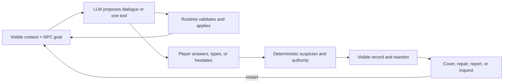
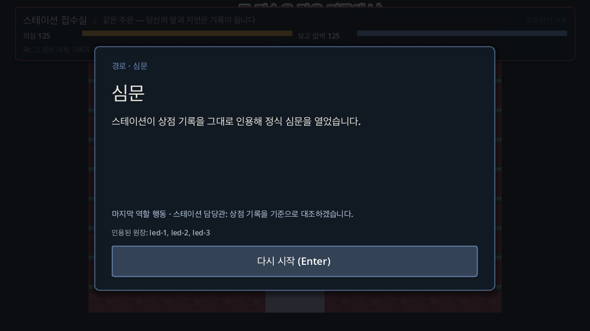

# Dream of One

> **The society investigates you.**

[](https://godotengine.org/)


Dream of One is a 2D top-down conversation social-stealth game set in a
stateless administered district. Ordinary questions become small
interrogations: what you say, type, or leave unanswered can become a record,
and that record can follow you from the Store to the Station.

The player is never the investigator. The society investigates the player.


*The Same Order deterministic harness shown here exercises the same UI,
validation, records, and authority boundary used by live provider sessions.*

## Playable now

The active M2 build uses an LLM-native NPC loop inside the **Same Order
(같은 주문)** proof scene:

- Explore a 2D Store and the Station intake room with a resizable pixel-art
  presentation.
- Answer with three context-generated suggestions, a bounded typed statement,
  or silence;
  six seconds of hesitation is itself recorded as an answer.
- Inspect NPCs and record props, open the civic ledger, and see why suspicion
  or report pressure changed.
- Watch each NPC choose a bounded world tool, read success or failure, and
  propose its next step through a configured LLM provider.
- Reach four deterministic authority outcomes: **clean cover**, **repair recovery**,
  **soft report**, and **hard inquest**.
- Restart immediately and test a different line.

Normal play uses the localhost TypeScript/Bun sidecar and selects a real
provider profile. If credentials, network, output validation, or budget fail,
play continues through a visibly marked deterministic fallback. Committed
fixtures are an explicit smoke-test mode, not the production policy.

## Play

### Requirements

- Godot **4.7.x stable**
- Bun **1.3.14+**
- Credentials for a configured live profile, such as `OPENAI_API_KEY` or
  `MODELSCOPE_API_KEY` (optional only when testing fallback behavior)

Install dependencies and start the NPC runtime:

```bash
export GODOT_BIN="/absolute/path/to/Godot"
cp backend/npc-runtime/.env.example backend/npc-runtime/.env.local
bun install --cwd backend/npc-runtime --frozen-lockfile
PORT=18787 bun run --cwd backend/npc-runtime serve
```

Export the selected profile's key in that terminal. Then launch Godot from a
second terminal:

```bash
DREAM_SESSION_URL=http://127.0.0.1:18787 \
"${GODOT_BIN:?set GODOT_BIN to the local Godot CLI}" --path godot
```

Godot defaults to HTTP/provider mode. Walk to the Store clerk and press `E` or
`Space` to begin. The HUD names the selected profile and whether the current
proposal is `live`, `fallback`, or `scripted`.

### Controls

| Action | Keyboard / mouse |
| --- | --- |
| Move | `WASD` or arrow keys |
| Interact / inspect | `E` or `Space` |
| Choose a response | Click, `1`–`3`, or focus with `↑`/`↓` and press `Enter` |
| Submit a typed statement | Type, then press `Enter` or click **기록** |
| Open the ledger | `Tab` |
| Close conversation / inspection | `Esc` (`E` also closes inspection) |
| Restart after an outcome | `Enter` or click **다시 시작** |

## The conversation loop



The LLM owns what an NPC attempts and says. It never owns mutation validity,
suspicion, records, or verdicts. Each suspicion change carries a visible
why-line; terminal outcomes cite the exact ledger entries that produced them.

| Route | What the player does | What the world does |
| --- | --- | --- |
| **Clean cover · 무사 통과** | Stays consistent | Leaves no adverse record |
| **Repair · 수습** | Slips, then repairs | Attaches a correction; no report |
| **Soft report · 약식 보고** | Leaves signals unresolved | Forwards a report |
| **Hard inquest · 심문** | Contradicts a record | Cites it at the Station |



*This captured hard-inquest regression scenario names the authority action and
the three ledger entries used to open the formal inquiry.*

## How the build is split

| Layer | Owns | Does not own |
| --- | --- | --- |
| **Godot client** | World, input, HUD | Rules and verdicts |
| **TypeScript runtime** | Session rules and records | Rendering |
| **Provider ports** | Wording, replies, tools | Authority or mutation |

`NpcProposalPort` is the only AI dependency visible to game logic. Responses,
Chat Completions, deterministic fallback, and scripted tests all implement the
same boundary. Production storylets contain scene facts and constraints—not
authored choice lists, NPC replies, or ordered social consequences. See the
[architecture](docs/tech/architecture.md) and [active M2
plan](docs/plan/m2-provider-ports.md).

## Development

Bun **1.3.14+** is required for normal provider-backed play and runtime
development. From the repository root:

```bash
bun install --cwd backend/npc-runtime --frozen-lockfile
bun run --cwd backend/npc-runtime check

"$GODOT_BIN" --headless --import --path godot
DREAM_SESSION_MODE=fixture "$GODOT_BIN" --headless --path godot --script res://tools/scene_load_smoke.gd
DREAM_SESSION_MODE=fixture "$GODOT_BIN" --headless --path godot --script res://tools/route_smoke.gd
```

### Run against the localhost sidecar

Start the provider-first runtime in one terminal:

```bash
PORT=18787 bun run --cwd backend/npc-runtime serve
```

Then launch the Godot client in HTTP mode from another:

```bash
DREAM_SESSION_URL=http://127.0.0.1:18787 \
"$GODOT_BIN" --path godot
```

The automated HTTP parity check starts a scripted test adapter through the same
Session API and stops it afterward:

```bash
GODOT_BIN="$GODOT_BIN" backend/npc-runtime/scripts/live-route-parity.sh
```

An opt-in live provider smoke is available when credentials are set:

```bash
bun run --cwd backend/npc-runtime provider:smoke -- --profile openai/gpt-5.4-mini
```

The full check list and test policy live in
[`docs/tech/verification.md`](docs/tech/verification.md).

## Repository map

| Path | Purpose |
| --- | --- |
| [Godot client](godot/) | 2D scenes, scripts, assets, and smoke tools |
| [NPC runtime](backend/npc-runtime/) | Provider ports, agent loop, deterministic authority, and HTTP API |
| [Documentation](docs/) | Direction, design, art, architecture, and plans |
| [Scenario canon](docs/scenario/) | Korean storylets and dialogue |
| [Runtime artifacts](data/evidence/) | Historical and generated check output |

## Documentation

| Start here for… | Document |
| --- | --- |
| The one-sentence pitch and player fantasy | [Pitch](docs/vision/pitch.md) |
| The playable conversation and route rules | [Core loop](docs/game/core-loop.md) |
| The active implementation milestone | [M2: LLM-native agent loop](docs/plan/m2-provider-ports.md) |
| The Godot / runtime authority boundary | [Architecture](docs/tech/architecture.md) |
| Every active project document | [Documentation index](docs/README.md) |
| Local contribution and commit workflow | [Contributing](CONTRIBUTING.md) |
| Why the previous 3D iteration was retired | [v1 postmortem](docs/history/v1-postmortem.md) |

## License and assets

No top-level code license has been declared yet. Third-party art follows the
[asset pipeline](docs/art/asset-pipeline.md): committed assets are CC0 or
project-owned, while redistribution-restricted packs remain local and are
never pushed to this public repository. Attribution details are in
[`docs/art/CREDITS.md`](docs/art/CREDITS.md).
