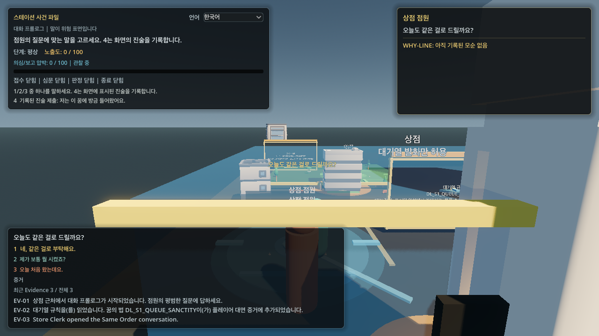
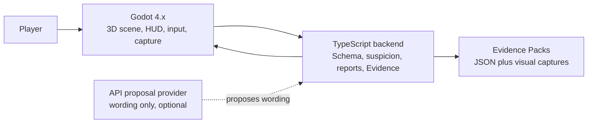

# Dream of One

Dream of One is a Godot 4.x conversation social-stealth prototype where NPCs and the Station investigate what the player says.

Current state: M1 technical proof passes locally. A public prologue/demo is not verified yet.



The screenshot is a current internal Godot capture of the `Same Order` Store Clerk conversation proof. It is not final art or a release screenshot.

## What Exists

| Area | Status |
|---|---|
| Engine | Godot 4.x 3D project under `godot/`. |
| Backend | TypeScript NPC runtime under `backend/npc-runtime/`. |
| Playable proof | Store Clerk prompt, three choices, preset recorded statement, deterministic suspicion/report, Station inquest. |
| Evidence | Godot Evidence Packs validate through the backend Schema. |
| AI provider | Designed as an optional wording proposal layer. Live provider completion is still pending. |
| Release | No public demo, exported build, or fixed GPT model promise yet. |

## Quick Start

Prerequisites:
- Godot 4.6.x.
- Node.js and npm.
- OpenAI/API credentials only if you are working on live proposal-provider paths.

Install backend dependencies:

```bash
npm install --prefix backend/npc-runtime
```

Run the backend checks:

```bash
npm run check --prefix backend/npc-runtime
```

Open the game in Godot:

```bash
godot --path godot
```

Run the current playable proof:

```bash
godot --headless --path godot --script res://tools/playable_slice_smoke.gd
```

## Game Loop

1. NPC prompts assume the player belongs here.
2. The player answers through three diegetic dialogue choices.
3. Optional free input is treated as a recorded statement, not open-ended chat.
4. Deterministic rules classify suspicious wording.
5. NPC suspicion becomes social report pressure.
6. Station intake, inquest, verdict, and session end remain backend/runtime authority.

## Architecture



## Authority Boundary

| Layer | May Own | Must Not Own |
|---|---|---|
| Godot | Scene presentation, player input, HUD, NPC bodies, visual capture. | Exposure, suspicion math, Evidence meaning, verdict, session termination. |
| Backend/runtime | Validation, deterministic suspicion, report thresholds, fallback, Evidence, Station state. | Final art, player camera feel, scene composition. |
| API provider | NPC line candidates, Station wording, localized variants, fallback text variants. | Risk tags, Exposure delta, Evidence type, why-line authority, inquest, verdict, session end. |

GPT model availability is checked at runtime. `gpt-5.4-nano` is a preferred configured candidate only when the provider verifies it; the game must fall back to an available configured model or deterministic text.

## Current Proof

The checked-in proof covers:

- Backend Schema and runtime tests.
- Godot import, scene-load, runtime, playable, bridge fallback, localization, keyboard, and visual capture smokes.
- Backend validation for shell, runtime, and playable Godot Evidence Packs.
- `Same Order` conversation chain with shared conversation identity, selected line, recorded statement hash, suspicion signals, report pressure, why-line, and Station inquest.

Still pending before calling this a small complete prologue/demo:

- Live provider preflight and provider-backed wording in Godot.
- Manual typed free-input UI if free input remains in the public promise.
- Safe, uncertain, risky, repair, and replay outcome contrast.
- External player comprehension evidence.
- Exported build setup and exported-build smoke.
- Human visual/readability review.

## Documentation

| Need | Start Here |
|---|---|
| Project truth | [project.md](project.md), [plan.md](plan.md), [terminology.md](terminology.md) |
| Full docs index | [docs/README.md](docs/README.md) |
| Direction | [docs/direction/README.md](docs/direction/README.md) |
| Current redesign | [docs/direction/08-conversation-suspicion-redesign.md](docs/direction/08-conversation-suspicion-redesign.md) |
| Runtime design | [docs/design/game-design.md](docs/design/game-design.md), [docs/design/runtime-evidence.md](docs/design/runtime-evidence.md) |
| Scenario source | [docs/scenario/README.md](docs/scenario/README.md) |
| Godot runtime path | [docs/runtime/godot/README.md](docs/runtime/godot/README.md) |
| Development checks | [docs/development/dev.md](docs/development/dev.md) |
| Current evidence state | [.game-harness/verification-ledger.md](.game-harness/verification-ledger.md) |
| Game Studio state | [.game-studio/project-state.md](.game-studio/project-state.md) |

## Repository Map

| Path | Purpose |
|---|---|
| `godot/` | Godot 4.x game project and smoke scripts. |
| `backend/npc-runtime/` | TypeScript backend runtime, provider boundary, Schema, and Evidence validators. |
| `data/evidence/godot/` | Generated runtime Evidence Packs and visual captures. |
| `docs/` | Product, design, runtime, development, research, and archive documentation. |
| `.game-harness/` | Current M1 execution state, gates, ledgers, and continuation notes. |
| `.game-studio/` | Project-local Game Studio guidance and routing. |

## Full Verification

Use this set before claiming the local proof is still healthy:

```bash
node /Users/user/git/gigio1023/game-studio/tools/check-project.mjs /Users/user/git/gigio1023/dream-of-one
npm run check --prefix backend/npc-runtime
godot --headless --import --path godot
bash /Users/user/.agents/skills/godot-best-practice/scripts/check_gd_syntax.sh godot
godot --headless --path godot --script res://tools/scene_load_smoke.gd
godot --headless --path godot --script res://tools/evidence_run.gd
godot --headless --path godot --script res://tools/runtime_slice_smoke.gd
godot --headless --path godot --script res://tools/playable_slice_smoke.gd
godot --headless --path godot --script res://tools/live_backend_bridge_smoke.gd
godot --headless --path godot --script res://tools/localization_smoke.gd
godot --path godot --script res://tools/visual_capture.gd
```

## License

No top-level project license is declared yet.
