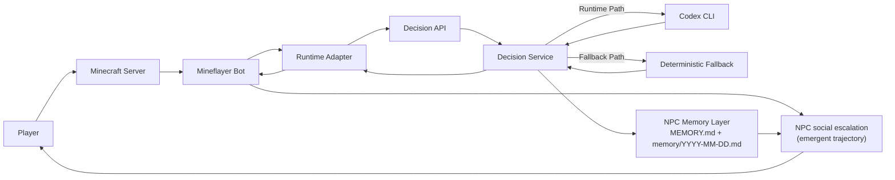
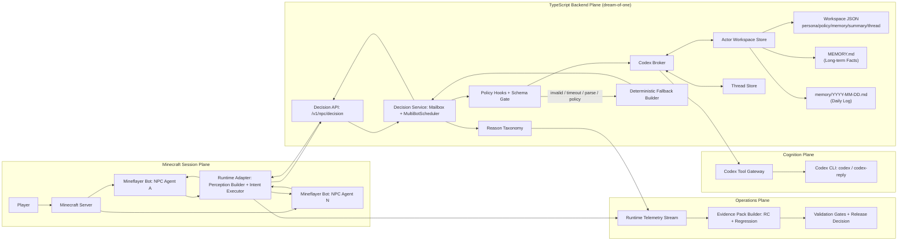
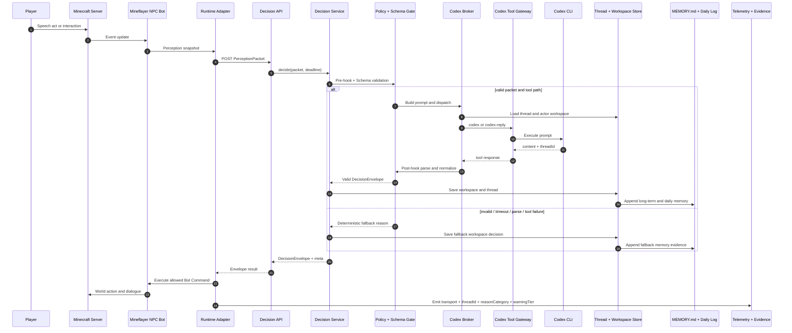

# Dream of One

Dream of One is a Unity social-stealth simulation where NPC society pressure is generated by stateful Codex-driven NPC actors and executed through deterministic world rules.

## Intent

Run a believable social-pressure loop where the player survives by performing cover work under procedural scrutiny.

## Goal

Ship a playable v0.1 slice that proves the primary question:

Can a Codex-driven NPC society run pressure against the player in live Unity play?

## Scope (v0.1)

- Session duration: 10-12 minutes.
- Fixed landmarks: `Store`, `Studio`, `Park`, `Station`.
- Fixed NPC action language: `Move`, `Talk`, `Ask`, `Observe`, `Work`, `Report`, `Escort`, `Idle`.
- Fixed player speech acts: `SA_COMPLY`, `SA_INQUIRE`, `SA_FRAME`, `SA_BREAK`.
- Endings: `Clean Pass`, `Narrow Escape`, `Exposed`.

## Game Design Overview

The loop is designed as one integrated system where Codex output transport, schema validation, deterministic fallback, and social escalation all connect in one cycle.

### Unified Runtime and Social Escalation Loop



#### Detailed View



### Runtime Path Sequence



## Architecture Boundaries

- Minecraft server + Mineflayer authority: world sensing, action validation, action execution, ending rules.
- Backend authority: NPC intent brokerage, thread continuity, schema validation.
- Codex authority: intent proposal only; no direct world mutation.
- Safety authority: deterministic fallback for timeout, tool, and parse failures.

## Quick Start

### Prerequisites

- Node.js `>=22`.
- Backend runtime in `backend/npc-runtime/`.
- Optional local LLM runtime (`ollama`) or OpenAI API key.
- Legacy Unity project (deprecated path) at `deprecated/unity/draem-of-one/`.

### Run

1. Open Unity Hub and add `deprecated/unity/draem-of-one/` (legacy/manual verification path).
2. Open `Assets/Scenes/Prototype.unity`.
3. Press Play.

## Controls

| Action | Input |
|---|---|
| Move | `WASD` |
| Jump | `Space` |
| Interact | `E` |
| Photo/Capture | `F` |
| Toggle log | `L` |
| Inspect next artifact | `I` |
| Toggle case panel | `C` |
| Toggle debug overlay | `F1` |
| Camera orbit | Hold `RMB` and move mouse |
| Camera zoom | Mouse wheel |
| Camera snap behind player | `R` |
| Camera distance presets | `1`, `2`, `3` |

## Optional LLM Configuration

### Local endpoint (Ollama)

```bash
ollama serve
ollama pull qwen3:4b-instruct
```

`LLMClient` scene configuration:

- `Provider = LocalEndpoint`
- `llmEnabled = true`
- `LocalEndpointMode = UtteranceProxy` with `http://localhost:11434/utterance`
- or `LocalEndpointMode = OpenAIChatCompletions` with `http://localhost:11434/v1/chat/completions`
- `LocalModel = Qwen3_4B_Instruct`

### OpenAI

- Set `OPENAI_API_KEY` in your environment.
- Configure provider/model enums in `LLMClient`.

## Validation Criteria (Local)

### Editor-first checks

Recommended for the 4-landmark rapid verification loop:
- `Tools > DreamOfOne > Apply Simple Verification Mode`
- `Tools > DreamOfOne > Run Diagnostics` until the console is clean.
- Unity Test Runner: `EditMode` and `PlayMode`.

Manual equivalent (if needed):
- `Tools > DreamOfOne > Build City (POLYGON, Simple Verification)`
- `Tools > DreamOfOne > Seed World Definition (Simple Verification)`
- `Tools > DreamOfOne > Rebuild World From Data`

### Headless checks

```bash
deprecated/unity/scripts/run_editor_diagnostics.sh
deprecated/unity/scripts/run_playmode_smoke.sh
deprecated/unity/scripts/run_all_checks.sh
```

## Evidence and Release Candidate Workflow

Runtime evidence scripts:

- `deprecated/unity/scripts/analyze_runtime_evidence.mjs`
- `deprecated/unity/scripts/collect_regression_metrics.mjs`
- `deprecated/unity/scripts/package_release_candidate.mjs`
- `deprecated/unity/scripts/collect_stability_trend.mjs`
- `deprecated/unity/scripts/run_stability_trend.sh`

Primary outputs:

- `logs/runtime-evidence-summary.json`
- `logs/regression-metrics.json`
- `logs/stability-trend.json`
- `logs/rc/<run-id>/manifest.json`

## Documentation Map

Single Source of Truth (SSOT) documents:

- Product definition: `project.md`
- Execution order and issue sequencing: Linear issues (governed by `project.md`)
- Canonical terminology: `terminology.md`

Design documents:

- Design bible: `docs/design/game-design.md`
- Dream Laws library: `docs/design/dream-laws.md`
- Cover Tests library: `docs/design/cover-tests.md`
- Runtime evidence guide: `docs/design/runtime-evidence.md`

Developer and agent operations:

- Developer guide: `docs/dev.md`
- Agent runbook: `docs/agent/runbook.md`
- Codex CLI workflow playbook: `docs/agent/codex-cli-workflow.md`
- Agent policy: `AGENTS.md`

## Work Management Model

- Linear issues are the single source of truth for task status.
- Beads (`bd`) is an internal execution graph for local dependency tracking.
- Codex Cloud is used only for cloud-safe tasks with no Unity MCP or serialized Unity asset dependency.

## Terminology and Language Rules

- Use canonical terms from `terminology.md` in docs, issue text, PR text, and user-facing runtime strings.
- Use `Specification` or `Schema` for API/data semantics.
- Keep documentation and code comments in English.

## Mermaid Verification

When you update Mermaid diagrams, validate rendering with Mermaid CLI before committing:

```bash
npx -y @mermaid-js/mermaid-cli -i <diagram>.mmd -o <diagram>.svg
```
