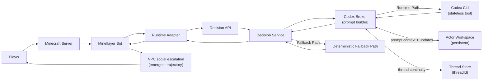
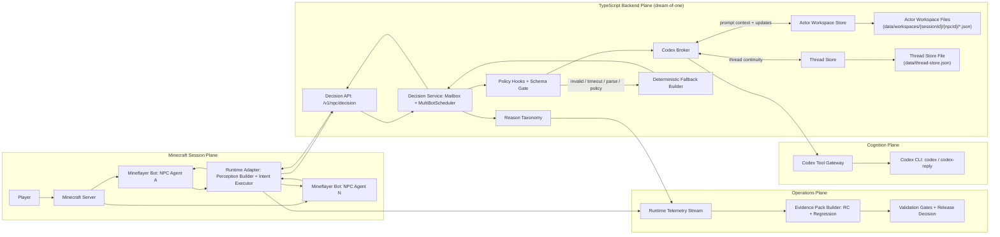
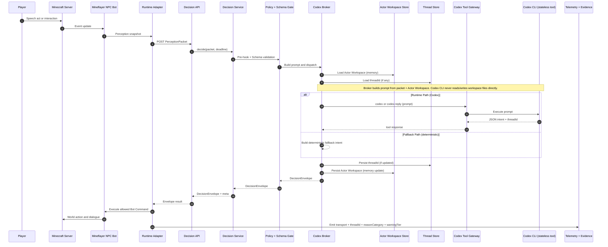

# Dream of One

Dream of One is a Minecraft social-stealth simulation where NPC society pressure is generated by stateful Codex-driven Mineflayer bots and executed through deterministic backend rules.

## Intent

Run a believable social-pressure loop where the player survives by performing cover work under procedural scrutiny.

## Goal

Ship a playable v0.1 slice that proves the primary question:

Can a Codex-driven NPC society run pressure against the player in a live Minecraft session?

## Scope (v0.1)

- Session duration: 10-12 minutes.
- Fixed landmarks: `Store`, `Studio`, `Park`, `Station`.
- Fixed NPC action language: `Move`, `Talk`, `Ask`, `Observe`, `Work`, `Report`, `Escort`, `Idle`.
- Fixed player speech acts: `SA_COMPLY`, `SA_INQUIRE`, `SA_FRAME`, `SA_BREAK`.
- Endings: `Clean Pass`, `Narrow Escape`, `Exposed`.
- Human player uses a Minecraft Java client in the same server session and is the primary social-pressure target.

Release status model for v0.1:
- `runtime-complete`: Runtime Path guardrails and required backend checks are green.
- `design-complete`: Dream Law/Cover Test causality is executable and verifiable.
- `release-complete`: Acceptance run protocol and release Evidence gates are satisfied.

Scope split model:
| Requirement area | v0.1 classification | Notes |
|---|---|---|
| 10-12 minute session loop in fixed four landmarks | v0.1 mandatory | Current release boundary |
| Bounded NPC/player language and deterministic Fallback Path | v0.1 mandatory | Runtime guardrail |
| Runtime Evidence and acceptance/release gates | v0.1 mandatory | Release decision basis |
| Economy/combat/progression expansion systems | post-v0.1 backlog | Not part of this cycle |
| Additional landmarks and freeform sandbox content | post-v0.1 backlog | Not part of this cycle |
| Unbounded action/speech generation requirements | post-v0.1 backlog | Explicitly disallowed in v0.1 |

## Human Player Setup (Session Entry)

Before running scenarios, connect a human Minecraft Java client to the same server used by Mineflayer:

1. Start or identify the Minecraft server host and port (`NPC_RUNTIME_MINEFLAYER_HOST`, `NPC_RUNTIME_MINEFLAYER_PORT`).
2. In Minecraft Java Multiplayer, add `<host>:<port>` and join with a username different from `npc-runtime-bot`.
3. Keep client/server compatibility aligned with runtime settings (`NPC_RUNTIME_MINEFLAYER_AUTH`, `NPC_RUNTIME_MINEFLAYER_VERSION`).
4. Start scenario evaluation only after the player appears in-world.

## Start Here

Use this quick path based on your role:

| Role | Start doc | Why |
|---|---|---|
| First-time contributor | `docs/overview.md` | One-page project explanation and visual map |
| Runtime developer | `docs/dev.md` | Local run, validation, evidence commands |
| Codex operator | `docs/agent/codex-cli-workflow.md` | End-to-end Codex CLI execution workflow |
| Product/design reviewer | `project.md` | Product goals, constraints, acceptance criteria |
| Mineflayer implementer | `docs/mineflayer/index.md` | Structured Mineflayer Specification/guides |

## Game Design Overview

The loop is designed as one integrated system where Codex transport, Schema validation, deterministic Fallback Path, and social escalation stay connected in one Runtime Path.

### Unified Runtime and Social Escalation Loop

#### Simple View



#### Detailed View



### Runtime Path Sequence



## Architecture Boundaries

- Minecraft Server + Mineflayer Bot authority: world sensing, action validation, action execution, ending rules.
- Backend authority: NPC intent brokerage, continuity stores, Schema validation, queue control.
- Codex authority: intent proposal only; no direct world mutation.
- Safety authority: deterministic fallback for timeout, tool, parse, and policy failures.

## Memory Design

Runtime NPC memory is persisted as **Actor Workspace** artifacts (JSON) per `sessionId+npcId` and injected into the Codex prompt by the Codex Broker.

- Implementation: `backend/npc-runtime/src/memory/actor-workspace-store.ts`
- Prompt context injection: `backend/npc-runtime/src/broker/codex-broker.ts`
- Design model: `docs/design/game-design.md`

## Quick Start

### Prerequisites

- Node.js `>=22`.
- Minecraft Java server reachable from local machine.
- Backend runtime source at `backend/npc-runtime/`.
- Codex CLI available for Runtime Path execution.
- Optional local LLM runtime (`ollama`) for custom tool runner experiments.

### Environment sanity checks

Run these before starting the runtime:

```bash
node -v
codex --version
nc -z 127.0.0.1 25565
```

Note:
- Port `25565` must be reachable by the Mineflayer Bot runtime.
- If your Minecraft server uses different host/port/version, set the corresponding `NPC_RUNTIME_MINEFLAYER_*` variables.

### Install and Validate

```bash
npm install --prefix backend/npc-runtime
npm run check --prefix backend/npc-runtime
```

### Run Primary Runtime Path (Mineflayer + backend)

```bash
NPC_RUNTIME_MINEFLAYER_ENABLED=1 \
NPC_RUNTIME_TELEMETRY_ENABLED=1 \
NPC_RUNTIME_MINEFLAYER_HOST=127.0.0.1 \
NPC_RUNTIME_MINEFLAYER_PORT=25565 \
NPC_RUNTIME_MINEFLAYER_USERNAME=npc-runtime-bot \
npm run dev --prefix backend/npc-runtime
```

### Join Human Player (Minecraft Java client)

After runtime startup, connect a human player to the same Minecraft server:

1. Open Minecraft Java client.
2. Join `NPC_RUNTIME_MINEFLAYER_HOST:NPC_RUNTIME_MINEFLAYER_PORT` (default `127.0.0.1:25565`).
3. Use a username that is not the bot username (`npc-runtime-bot`).

### Runtime Endpoint Smoke Check

```bash
curl -s http://127.0.0.1:8787/health | jq .
curl -s http://127.0.0.1:8787/health/ready | jq .
curl -s http://127.0.0.1:8787/health/queue | jq .
curl -s "http://127.0.0.1:8787/v1/telemetry/events?limit=20" | jq .
```

### Legacy Unity Path (deprecated)

Rollback drill and Unity archive docs:
- `docs/deprecated/unity/index.md`
- `docs/deprecated/unity/dev.md`

These links are archival references only. They are not active Runtime Path authority.

Note: GitHub may display C# as the primary language due to the Unity archive; the archive is excluded from Linguist language stats via `.gitattributes`.

## Optional LLM Configuration

OpenAI:
- Set `OPENAI_API_KEY` in your environment for tool-runner integrations.

Local endpoint (Ollama):
```bash
ollama serve
ollama pull qwen3:4b-instruct
```

## Validation Criteria (Local)

### Backend Runtime Checks

```bash
npm run check --prefix backend/npc-runtime
```

### Mineflayer-native Gate H Checks

Run each session with backend runtime logs, then execute:

```bash
npm run ws8:release-gate:backend --prefix backend/npc-runtime -- --run-id rc-ws8-run-a --strict
npm run ws8:events:snapshot --prefix backend/npc-runtime -- --out data/evidence/ws8/gate-h/run-a-events.json
```

Repeat for `run-b` and `run-c`, then verify trajectory diversity:

```bash
npm run ws8:trajectory:verify --prefix backend/npc-runtime -- \
  --evidence data/evidence/ws8/gate-h/run-a-evidence-pack.json \
  --evidence data/evidence/ws8/gate-h/run-b-evidence-pack.json \
  --evidence data/evidence/ws8/gate-h/run-c-evidence-pack.json \
  --out data/evidence/ws8/gate-h/trajectory-diversity.json --strict
```

### Legacy Unity Checks (deprecated rollback path)

See:
- `docs/deprecated/unity/dev.md`

These checks are optional archival rollback verification and never release-blocking for Mineflayer Runtime Path decisions.

## Evidence and Release Candidate Workflow

Mineflayer/backend evidence scripts (`backend/npc-runtime/package.json`):

- `npm run ws8:evidence:backend --prefix backend/npc-runtime`
- `npm run ws8:metrics:backend --prefix backend/npc-runtime`
- `npm run ws8:rc:backend --prefix backend/npc-runtime`
- `npm run ws8:release-gate:backend --prefix backend/npc-runtime`
- `npm run ws8:events:snapshot --prefix backend/npc-runtime`
- `npm run ws8:trajectory:verify --prefix backend/npc-runtime`
- `npm run ws8:rollback-drill --prefix backend/npc-runtime`

Primary outputs:

- `logs/runtime-evidence-summary-backend.json`
- `logs/regression-metrics-backend.json`
- `logs/rc/<run-id>/manifest.json`
- `data/evidence/ws8/gate-h/*`

## Documentation Map

Single Source of Truth (SSOT) documents:

- Product definition: `project.md`
- Execution order and issue sequencing: Linear issues (governed by `project.md`)
- Authority map: `docs/authority-map.md`
- Canonical terminology: `terminology.md`

Design documents:

- Design bible: `docs/design/game-design.md`
- Dream Laws library: `docs/design/dream-laws.md`
- Cover Tests library: `docs/design/cover-tests.md`
- Rule-to-runtime trace matrix: `docs/design/rule-runtime-trace-matrix.md`
- Social causality verification: `docs/design/social-causality-verification.md`
- Acceptance session protocol: `docs/design/acceptance-session-protocol.md`
- Runtime evidence guide: `docs/design/runtime-evidence.md`
- Mineflayer Specification and guides: `docs/mineflayer/index.md`
- Visual overview: `docs/overview.md`

Developer and agent operations:

- Developer guide: `docs/dev.md`
- Agent runbook: `docs/agent/runbook.md`
- Codex CLI workflow playbook: `docs/agent/codex-cli-workflow.md`
- Decision ledger guide: `docs/agent/decision-ledger.md`
- Acceptance review template: `docs/agent/templates/acceptance-review-template.md`
- Agent policy: `AGENTS.md`

## Work Management Model

- Linear issues are the single source of truth for task status.
- Beads (`bd`) is an internal execution graph for local dependency tracking.
- Codex Cloud is used only for cloud-safe tasks with no Unity MCP or serialized Unity asset dependency.

## Terminology and Language Rules

- Use canonical terms from `terminology.md` in docs, issue text, PR text, and user-facing runtime strings.
- Use `Specification` or `Schema` for API/data semantics.
- Keep documentation and code comments in English.

## Mermaid Verification

When you update Mermaid diagrams, validate rendering with Mermaid CLI before committing:

```bash
npx -y @mermaid-js/mermaid-cli -i <diagram>.mmd -o <diagram>.svg
```
