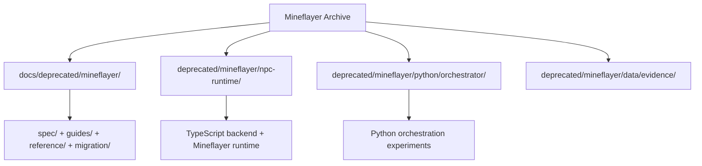

# Deprecated Mineflayer Archive

This subtree preserves the earlier Mineflayer + TypeScript runtime exploration for Dream of One. It is an archive, not the active runtime path. The current playable implementation lives in the Unity project at the repository root.

## Archive Layout



## What Lives Here

- `docs/deprecated/mineflayer/index.md`
  - archived documentation set for the Mineflayer runtime direction
- `docs/deprecated/mineflayer/spec/`
  - Runtime Path, action API, and lifecycle Specification
- `docs/deprecated/mineflayer/guides/`
  - implementation and onboarding guides
- `docs/deprecated/mineflayer/migration/`
  - crosswalk and coverage evidence from the document reorganization
- `deprecated/mineflayer/npc-runtime/`
  - Node 22 TypeScript service, Codex broker, thread store, actor workspace store, telemetry, and Mineflayer runtime
- `deprecated/mineflayer/python/orchestrator/`
  - earlier Python orchestration experiments
- `deprecated/mineflayer/data/evidence/`
  - archived runtime Evidence artifacts

## Read Order

1. `docs/deprecated/mineflayer/index.md`
2. `docs/deprecated/mineflayer/spec/runtime.md`
3. `docs/deprecated/mineflayer/guides/implementation.md`
4. `docs/deprecated/mineflayer/migration/crosswalk.md`

## Archive Runtime Snapshot

The archived runtime in `deprecated/mineflayer/npc-runtime/` contains:

- HTTP server and decision entrypoint
- Codex broker and tool gateway
- thread and actor workspace persistence
- scheduler, fallback handling, and telemetry
- Mineflayer runtime bridge and lifecycle gates

## Archived Commands

From `deprecated/mineflayer/npc-runtime/`:

```bash
npm install
npm run check
```

```bash
NPC_RUNTIME_MINEFLAYER_ENABLED=1 \
NPC_RUNTIME_TELEMETRY_ENABLED=1 \
npm run dev
```

Useful archive scripts:

- `npm run ws8:evidence:backend`
- `npm run ws8:metrics:backend`
- `npm run ws8:rc:backend`
- `npm run ws8:release-gate:backend`
- `npm run ws8:events:snapshot`
- `npm run ws8:trajectory:verify`
- `npm run ws8:rollback-drill`

## Important Notes

- Older archived docs may still say `docs/mineflayer/...`; in this repository the archived documentation root is `docs/deprecated/mineflayer/...`.
- The archive is kept for migration context, historical Evidence, and design traceability.
- Do not treat the Mineflayer archive as the default implementation path unless you are intentionally working on historical recovery or comparison work.
