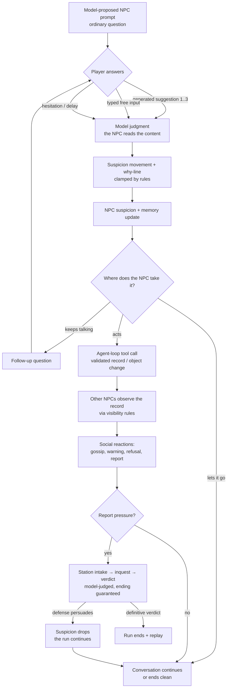

# Core Loop

## Moment-to-moment loop

The model is the NPC's mind: it proposes the utterance and reply suggestions,
judges how suspicious the player's answer is (and why), and chooses the next
tool attempt. Deterministic rules enforce validity only: per-turn delta caps,
visibility of context, tool validation, and a session that always ends.

## The answer surface

- **Three generated diegetic suggestions** per prompt, requested with a felt
  safety gradient: one safe, one uncertain, one risky. The gradient must be
  inferable from the fiction, never labeled. They are proposed at runtime from
  visible context, not stored in the storylet. Choosing one is identical to
  typing that line — either way the NPC's model reads the content.
- **Typed free input** — a bounded text field ("기타…"). This is real
  conversation: the NPC understands the content and responds to it. The bound
  is ergonomics (typing fatigue) and injection surface control, not a limit on
  what the conversation means. Submitted text is hashed into the session
  record and treated in-fiction as a *recorded statement*.
- **Hesitation is an answer only under interrogation.** Ordinary
  conversation has no timer and no delay record — slow answers cost nothing
  (owner direction 2026-07-11). Inside explicit high-pressure Station beats
  a generous (≥40s) timer emits `response_hesitation_noted`, a real signal
  the officer can act on.

## Suspicion model (model-judged, rule-bounded)

The judging NPC's model receives the player's line, the conversation so far
(both sides), and only the context that NPC has seen, heard, or read. It
returns how much suspicion moved, which signal classes applied, and a
player-visible why-line. The signal taxonomy
(`backend/npc-runtime/src/runtime/conversation-suspicion.ts`) survives as
shared vocabulary and as the deterministic fallback when the provider is
unavailable — fallback judgment is visibly marked and is never the product
experience.

Rules enforce validity around the judgment:

- per-turn suspicion/report deltas are clamped to a bounded range;
- accumulated scores are clamped to `0..125`;
- every movement carries a why-line the player can read;
- thresholds only guarantee that accumulated pressure eventually reaches an
  ending — they do not decide what an answer *means*.

## Canonical routes (regression tests only)

The four canonical arcs — clean cover (무사 통과), repair recovery (수습),
soft report (약식 보고), hard inquest (심문) — are **regression scenarios**,
kept alive by the scripted test adapter and fixtures. Live play may leave
them: an unexpected but valid NPC action or a persuasive player argument is
gameplay, not a defect. The replay promise is that different answers lead to
visibly different social consequences that cite different records — not that
play lands on one of four authored endings.

## Run and session shape

- A **run** (회차) is the unit of play: the player arrives with a purpose
  and a deadline (sourced from scenario canon), and a run spans multiple
  conversations and incidents. Suspicion, records, and the ledger persist
  across conversations within a run and reset between runs.
- **Run time is action-cost.** A day splits into segments; a meaningful
  conversation or incident consumes one, and resting a segment slightly
  lowers suspicion. The clock never moves while the player thinks or types
  — deadline pressure is "chances left," never a running clock.
- **The purpose is achieved through conversation only** — asking, probing,
  persuading. Approaching the goal and risking suspicion are the same act;
  there are no fetch-quest mechanics.
- A **conversation session** stays the runtime unit: it always reaches an
  ending, and the runtime owns that guarantee. A session ending is not a run
  ending — being reported and interrogated is an in-run event, and a defense
  that persuades lowers suspicion and returns the player to the run. Only
  achieving the purpose, missing the deadline, or a definitive Station
  verdict ends a run.
- A conversation is a few minutes; a run fits one sitting in M3 and grows
  toward the 15–30 minute prologue demo by M5. Mid-run save is deliberately
  deferred: if runs outgrow one sitting, M4's save/load moves up.
- The outcome panel names the closing role action and cites only ledger
  entries that actually exist; it never narrates a consequence that did not
  happen.
- Restart starts a new run instantly and keeps nothing except the player's
  knowledge.

## What "fun" means here (fun-gate rubric)

The fun gate is subjective by design, but these are the felt qualities to aim
for: (1) answering under social pressure feels risky (the clock joins in
only under Station interrogation); (2) watching
suspicion travel between NPCs is legible and a little dreadful; (3) losing
makes the player immediately want to try a different line; (4) the town feels
like it keeps existing when you're not talking to it.
