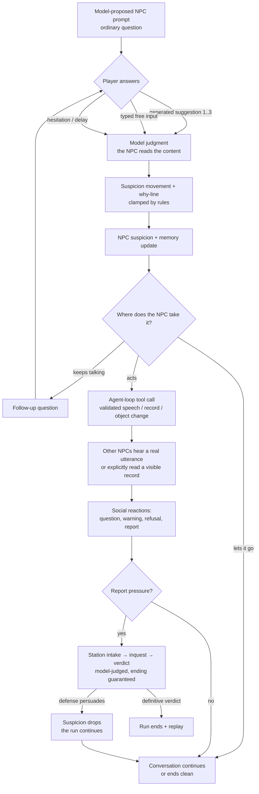

# Core Loop

## Moment-to-moment loop

The model is the NPC's mind: it proposes the utterance and reply suggestions,
judges how suspicious the player's answer is (and why), and chooses the next
tool attempt. Deterministic rules enforce validity only: per-turn delta caps,
visibility of context, tool validation, and a session that always ends.

## The answer surface

- **Three generated diegetic suggestions** per prompt, requested with a felt
  safety gradient: one safe, one uncertain, one risky. The gradient must be
  inferable from the fiction, never labeled. They are proposed at runtime from
  visible context, not stored in the storylet. Choosing one is identical to
  typing that line — either way the NPC's model reads the content.
- **Typed free input** — a bounded text field ("기타…"). This is real
  conversation: the NPC understands the content and responds to it. The bound
  is ergonomics (typing fatigue) and injection surface control, not a limit on
  what the conversation means. Submitted text is hashed into the session
  record and treated in-fiction as a *recorded statement*.
- **Hesitation is an answer only under interrogation.** Ordinary
  conversation has no timer and no delay record — slow answers cost nothing
  (owner direction 2026-07-11). Inside explicit high-pressure Station beats
  a generous (≥40s) timer emits `response_hesitation_noted`, a real signal
  the officer can act on.

## Suspicion model (model-judged, rule-bounded)

The judging NPC's model receives the player's line, the conversation so far
(both sides), and only the context that NPC has seen, heard, or read. It
returns how much suspicion moved, which signal classes applied, and a
player-visible why-line. The signal taxonomy
(`backend/npc-runtime/src/runtime/conversation-suspicion.ts`) survives as
shared vocabulary and as the deterministic fallback when the provider is
unavailable — fallback judgment is visibly marked and is never the product
experience.

Rules enforce validity around the judgment:

- per-turn suspicion/report deltas are clamped to a bounded range;
- accumulated scores are clamped to `0..125`;
- every movement carries a why-line the player can read;
- thresholds only guarantee that accumulated pressure eventually reaches an
  ending — they do not decide what an answer *means*.

## Canonical routes (regression tests only)

The four canonical arcs — clean cover (무사 통과), repair recovery (수습),
soft report (약식 보고), hard inquest (심문) — are **regression scenarios**,
kept alive by the scripted test adapter and fixtures. Live play may leave
them: an unexpected but valid NPC action or a persuasive player argument is
gameplay, not a defect. The replay promise is that different answers lead to
visibly different social consequences that cite different records — not that
play lands on one of four authored endings.

## Run and session shape

- A **run** (회차) is the unit of play: the player arrives as an outsider,
  and a Station hearing (청문회) is already scheduled for a known day — the
  run's deadline, announced diegetically, never a countdown on the input box.
  Suspicion, records, stances, and the ledger persist across conversations
  within a run and reset between runs.
- **World time is continuous.** The town, NPC schedules, and NPC-to-NPC
  conversations run in real time during free exploration; everything pauses
  while the player is inside a modal conversation, including the merged
  judgment+reply wait. Ambient provider calls remain asynchronous and never
  pause free exploration; their proposed effects are applied only after a
  fresh world-revision validation. If a modal conversation begins before an
  ambient result returns, the result may finish but waits to apply until the
  world resumes. Thinking and typing never cost anything. Pressure between
  conversations comes from schedule windows and other people's meetings —
  whom to catch before which encounter — not from wall-clock speed.
- **Progress is belief-editing.** Each NPC holds a stance toward the player
  built from what it actually saw, heard, and was told. This stance is the
  coarse presentation of the existing per-NPC opinion, not another meter:
  `oppose`, `uncertain`, or `vouch`. Stances move only when a conversation
  (the player's, or one NPC's with another) changes what an NPC believes —
  never for mere contact or reading a record. A positive vouch additionally
  requires a meaningful first-hand conversation with the player; hearsay can
  create doubt but cannot manufacture one. There are no friendship meters and
  no per-day accrual: novel, true, relevant speech is the only currency.
- **The hearing ends the run.** On the scheduled day the Station pools the
  six NPCs' real memories and stances. A four-of-six `vouch` quorum is the
  deterministic eligibility floor, not the verdict: after the player's final
  defense and one last memory-grounded stance reassessment, the model judges
  the pooled account inside deterministic procedure. Classified ordinary →
  the player may leave (win). Definitive abnormal verdict → run ends (loss).
  An NPC who never met the player testifies exactly that and cannot vouch.
- **Interrogation before the hearing is survivable.** Being reported and
  questioned is an in-run event: a defense that persuades lowers suspicion
  and returns the player to the run. An in-run recovery path exists —
  consistent, ordinary interactions genuinely lower a wary NPC's suspicion —
  so one slip is never a hidden death spiral.
- **The purpose is pursued through conversation only** — asking, probing,
  persuading, repairing. Approaching the goal and risking suspicion are the
  same act; doors and selected props make the space tangible but cannot
  advance a vouch. There are no fetch-quest mechanics and no inventory.
- A **conversation session** stays the runtime unit: it always reaches an
  ending, and the runtime owns that guarantee. A session ending is not a run
  ending. A cleanly ended conversation cannot be reopened against the same
  unchanged evidence; that NPC becomes available again after a relevant new
  memory, goal, schedule event, or player action changes the context. This
  prevents modal pause from becoming an infinite deadline freeze without
  charging the player for reading or typing.
- A run targets 30–60 minutes in one sitting. Mid-run save is deliberately
  deferred: if runs outgrow one sitting, save/load moves up from the next
  milestone.
- The run recap is ledger-built — what the town learned about you, who said
  what to whom — and cites only entries that actually exist.
- Restart starts a new run instantly and keeps nothing except the player's
  knowledge.

## What "fun" means here (fun-gate rubric)

The fun gate is subjective by design, but these are the felt qualities to aim
for: (1) answering under social pressure feels risky (the clock joins in
only under Station interrogation); (2) watching
suspicion travel between NPCs is legible and a little dreadful; (3) losing
makes the player immediately want to try a different line; (4) the town
visibly keeps existing when you're not talking to it — and that motion is
quietly threatening, because some of it is about you.
