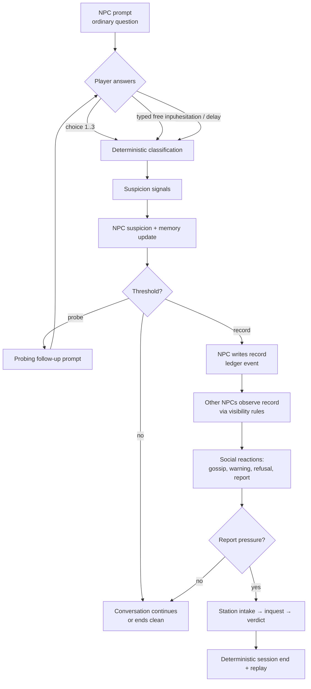

# Core Loop

## Moment-to-moment loop

Every arrow after "Player answers" is deterministic. The LLM only colors the
words NPCs use and proposes which tool an NPC tries next; it cannot move the
state machine.

## The answer surface

- **Three diegetic choices** per prompt, always with a felt safety gradient:
  one safe, one uncertain, one risky. The gradient must be inferable from the
  fiction (what a normal resident would say), never labeled.
- **Typed free input** — a bounded text field. Submitted text is classified
  deterministically (keyword/pattern/contradiction rules), hashed into the
  session record, and treated in-fiction as a *recorded statement*. It is not
  open-ended chat and the UI never implies it is.
- **Hesitation is an answer.** Delay past a threshold emits
  `response_hesitation_noted` — a real signal NPCs can act on.

## Suspicion model (deterministic)

Carried from v1's proven taxonomy (`backend/npc-runtime/src/runtime/conversation-suspicion.ts`,
`policy/reason-taxonomy.ts`):

- Signal classes: odd wording, contradiction with a known record, hesitation,
  refusal, over-explanation.
- Each signal carries a reason code and a why-line (플레이어에게 보여줄 이유
  문장) so the player can always learn *why* suspicion moved.
- Per-NPC suspicion accumulates; crossing thresholds unlocks NPC behaviors
  (probe → note → share → report), each visible in-world.

## Route contrast (the replay promise)

Every storylet must support the four canonical routes end to end:

| Route | Player behavior | Terminal state |
|---|---|---|
| Clean cover (무사 통과) | Safe answers, no signals | NPC closes interaction; no record |
| Repair recovery (수습) | A slip, then a successful repair action | Record created then resolved; small trust cost |
| Soft report (약식 보고) | Accumulated signals without repair | Manager/intermediary pauses service, forwards report; social friction persists |
| Hard inquest (심문) | Risky statement or contradiction | Station cites the exact record chain, formal inquest, locked session end |

Replay rule: a player who answers differently must be able to name what they
did differently and see a different terminal panel that cites different
records.

## Session shape

- A session is 5–15 minutes in M1 (single storylet) growing to 15–30 minutes
  by M5 (prologue arc across locations).
- Sessions always reach a deterministic end state with an outcome panel that
  names: the route, the role action that closed/escalated it, and the exact
  ledger entries cited.
- Restart is instant and keeps nothing except the player's knowledge.

## What "fun" means here (fun-gate rubric)

The fun gate is subjective by design, but these are the felt qualities to aim
for: (1) answering under mild time/social pressure feels risky; (2) watching
suspicion travel between NPCs is legible and a little dreadful; (3) losing
makes the player immediately want to try a different line; (4) the town feels
like it keeps existing when you're not talking to it.
