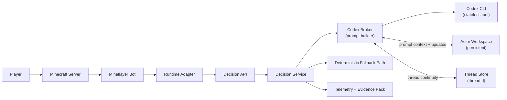
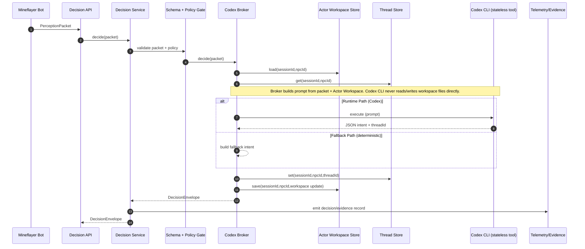
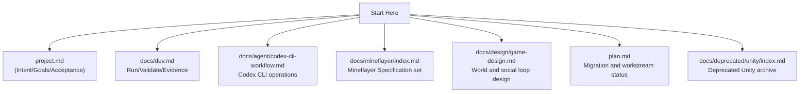

# Project Overview and Visual Guide

Revision date: 2026-02-17

This document is the shortest path to understand what this repository does, how Runtime Path works, and where each document belongs.

## 1) Project at a glance

Dream of One is a Minecraft social-stealth simulation:
- NPC society behavior is proposed by Codex.
- Runtime safety remains deterministic (Schema + Fallback Path).
- Mineflayer + TypeScript backend is the active Runtime Path.
- Unity is retained only as a deprecated rollback path (`docs/deprecated/unity/index.md`).

Canonical product definition:
- `project.md`

## 2) Runtime context visualization

## 3) Runtime decision flow

## 4) Documentation map visualization

## 5) Reading paths by purpose

| Purpose | Read in order |
|---|---|
| Understand product scope first | `project.md` -> `docs/design/game-design.md` -> `plan.md` |
| Run backend and validate runtime | `docs/dev.md` -> `README.md` quick start -> `docs/design/runtime-evidence.md` |
| Implement/modify Mineflayer behavior | `docs/mineflayer/index.md` -> `docs/mineflayer/spec/runtime.md` -> `docs/mineflayer/spec/action-api.md` -> `docs/mineflayer/guides/implementation.md` |
| Operate Codex workflow safely | `docs/agent/runbook.md` -> `docs/agent/codex-cli-workflow.md` |

## 6) Terminology and Source of Truth

- Work Source of Truth: Linear issues.
- Product Source of Truth: `project.md`.
- Canonical terminology: `terminology.md`.
- This overview summarizes and links; canonical rules stay in owner documents.
