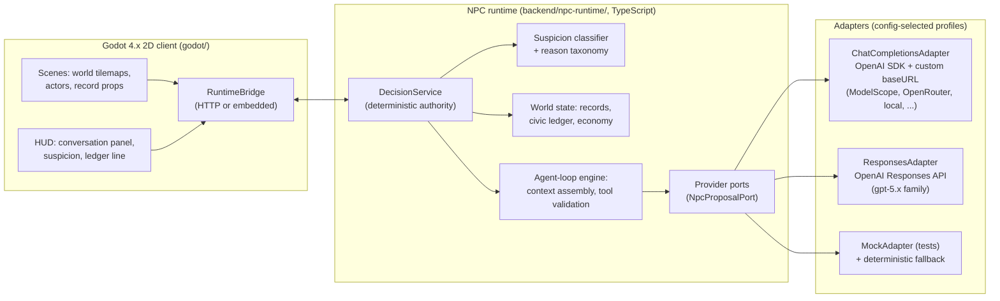

# Architecture

## System map



## Boundaries (load-bearing)

1. **Godot never computes truth.** The client renders state, captures input,
   and forwards player actions/answers to the runtime. All suspicion, record,
   ledger, verdict, and session-end decisions come back from the runtime.
2. **The runtime never touches a vendor SDK.** All LLM access goes through
   `NpcProposalPort`; adapters are the only files that import the OpenAI SDK
   or know a base URL. Spec: [`ai-provider-ports.md`](ai-provider-ports.md).
3. **Providers never mutate.** Adapter output is a `ProposalEnvelope`
   (wording + at most one tool call); the agent-loop engine validates it like
   any other candidate action.

## Client ↔ runtime transport

- **Dev default: HTTP sidecar.** The runtime runs as a local Node process
  (`npm run serve`) exposing the v1-proven endpoint shape
  (`/v1/npc/decision`, plus v2 session endpoints). Godot talks JSON over
  localhost. Fast iteration, engine-independent testing.
- **Packaging decision (deferred to M5):** bundle Node sidecar with the
  export vs. port the (small, dependency-light) decision core to GDScript.
  Default assumption is the bundled sidecar; decide with real export testing.
  Both paths keep schema as the contract, so the choice does not leak into
  M1–M4 work.

## Data flow contracts

- **Schema first.** `backend/npc-runtime/src/runtime/schema.ts` +
  `src/godot/runtime-schema.ts` define every packet crossing a boundary
  (session events, decision packets, proposal envelopes, ledger events).
  Zod-validated on both ingress and egress. Godot-side parsing stays dumb.
- **Semantic world layout.** `godot/data/world_layout.json` remains the
  source for landmarks/zones/anchors/actors, extended with a `tile` block
  (grid coords) for 2D. The client renders it; the runtime reasons over it.
  One file, two consumers, no duplicated world truth.
- **Content as data.** Storylets compile from `docs/scenario/` canon into
  runtime data (`backend/npc-runtime/data/storylets/*.json`); lines, choices,
  classification patterns, and route definitions are data, not code.

## Repo layout target

```
godot/                     # 2D client (rebuilt in M1)
  scenes/ scripts/ assets/ data/ tools/
backend/npc-runtime/
  src/
    runtime/               # deterministic core (kept+trimmed from v1)
    agentloop/             # v2: context assembly, tool validation, iteration
    providers/             # v2: ports, adapters, registry, budget
    api/                   # http server
    contracts|godot/       # schemas
  data/storylets/          # compiled content
docs/                      # this documentation tree
```

Module inventory and the v1 keep/trim/remove list:
[`npc-runtime.md`](npc-runtime.md).
