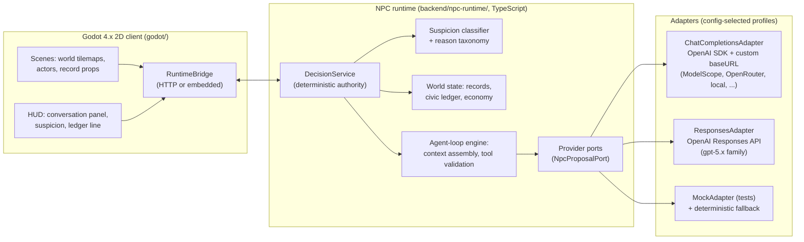

# Architecture

## System map



## Boundaries (load-bearing)

1. **Godot never computes truth.** The client renders state, captures input,
   and forwards player actions/answers to the runtime. All suspicion, record,
   ledger, verdict, and session-end decisions come back from the runtime.
2. **The runtime never touches a vendor SDK.** All LLM access goes through
   `NpcProposalPort`; adapters are the only files that import the OpenAI SDK
   or know a base URL. Spec: [`ai-provider-ports.md`](ai-provider-ports.md).
3. **Providers never mutate.** Adapter output is a `ProposalEnvelope`
   (wording + at most one tool call); the agent-loop engine validates it like
   any other candidate action.

## Where the NPC brains live — decided: the TS runtime

The question that settles the client/runtime split: where is it best to
implement *many concurrent NPC brains* that assemble context, talk to LLM
provider APIs, and manage memory? Answer: TypeScript, decisively.

| Concern | TS runtime (Node) | GDScript in-engine |
|---|---|---|
| Concurrent LLM calls for N NPCs | Native async I/O; trivial fan-out, timeout, retry per NPC | `HTTPRequest` nodes + signal plumbing per call; awkward at N>2 |
| Provider SDKs | Official OpenAI SDK (both API shapes), mature streaming | No first-class LLM SDK; hand-rolled HTTP + SSE parsing |
| Schema validation of proposals | zod at every boundary, typed end to end | Manual `Dictionary` checking, no type safety |
| Context/prompt assembly, token budgeting | First-class string/JSON tooling, tokenizer libs | Possible but clumsy |
| Testing brains without the engine | Plain unit/fixture tests, headless simulation of whole social scenes | Engine-coupled tests only |
| Frame-rate isolation | Brain latency can never hitch rendering (separate process) | LLM waits share the main loop |

So: **brains (agent loop, context assembly, provider ports, memory, all
deterministic authority) live in `backend/npc-runtime/`. Godot is the body
and the stage** — senses in (observations, player input), actions out
(validated mutations to render). This also means the whole social sim can run
headless (fixture NPCs conversing without a renderer), which is how agent-loop
work gets tested from M3 on.

### Full re-evaluation record (2026-07-10, owner-requested)

The owner asked for a from-scratch reconsideration with reimplementation on
the table. Candidates evaluated with web research (evidence in PR): TS Node
sidecar, Python sidecar, Godot C#/.NET in-process, GDScript native.

- **Godot C# in-process** is genuinely viable on desktop: official
  `openai-dotnet` SDK is mature (Responses API stable since 2025-12, custom
  baseURL first-class → ModelScope works), and Godot's main-thread
  `GodotSynchronizationContext` makes `HttpClient` + async/await safe. Its win
  is eliminating sidecar lifecycle/port/dual-signing costs. Its costs: C#
  **cannot export to web** (unresolved through 4.7, draft-PR only), thin
  shipped precedent for Godot C# + LLM, brain iteration coupled to engine
  compile cycles, and lower AI-agent fluency with Godot C# than TS.
- **TS sidecar** keeps brain iteration and testing fully engine-independent,
  reuses the proven v1 schema/suspicion core, and has direct shipping
  precedent (Screeps: World has bundled a Node server on Steam since 2016).
  Sidecar costs (orphan processes, port conflicts, per-executable
  signing/notarization) are real but M5-localized with documented mitigations.
- **Python sidecar** has the best LLM ecosystem but the worst packaging
  friction (PyInstaller AV false positives, macOS notarization landmines); the
  owner expressed no language preference, removing its main upside.
- **GDScript native** stays rejected (no SDK, hand-rolled validation,
  engine-coupled tests).

**Decision rule:** with agents writing most code, brain iteration speed,
headless testability, and agent fluency outweigh single-process deployment
simplicity. **Decision: keep the TS sidecar.** Constraints adopted from the
research: treat Chat Completions as the lowest common denominator for
OpenAI-compatible endpoints (Responses only for OpenAI itself); bind the
sidecar to localhost with a dynamic port; the game must kill the sidecar on
exit (orphan processes are the #1 documented sidecar failure).

**Reversal conditions:** (a) a browser/web demo becomes a requirement → move
brains to a hosted server (TS/Python), C# stays excluded; (b) M5 bundling
fails in practice → try single-binary compilation (Bun compile / Node SEA)
before any C# re-evaluation.

## Client ↔ runtime transport

- **HTTP sidecar.** The runtime runs as a local Node process
  (`npm run serve`) exposing the v1-proven endpoint shape
  (`/v1/npc/decision`, plus v2 session endpoints). Godot talks JSON over
  localhost. Fast iteration, engine-independent testing.
- **Packaging (M5 detail, not an architecture question):** the shipped build
  bundles the sidecar (launcher starts/stops it; Node runtime packaged
  per-OS). Porting brains to GDScript is explicitly rejected per the table
  above; if bundling proves painful at M5, the fallback investigation is a
  compiled single-binary sidecar (e.g. pkg/bun-style), never an engine port.

## Data flow contracts

- **Schema first.** `backend/npc-runtime/src/runtime/schema.ts` +
  `src/godot/runtime-schema.ts` define every packet crossing a boundary
  (session events, decision packets, proposal envelopes, ledger events).
  Zod-validated on both ingress and egress. Godot-side parsing stays dumb.
- **Semantic world layout.** `godot/data/world_layout.json` remains the
  source for landmarks/zones/anchors/actors, extended with a `tile` block
  (grid coords) for 2D. The client renders it; the runtime reasons over it.
  One file, two consumers, no duplicated world truth.
- **Content as data.** Storylets compile from `docs/scenario/` canon into
  runtime data (`backend/npc-runtime/data/storylets/*.json`); lines, choices,
  classification patterns, and route definitions are data, not code.

## Repo layout target

```
godot/                     # 2D client (rebuilt in M1)
  scenes/ scripts/ assets/ data/ tools/
backend/npc-runtime/
  src/
    runtime/               # deterministic core (kept+trimmed from v1)
    agentloop/             # v2: context assembly, tool validation, iteration
    providers/             # v2: ports, adapters, registry, budget
    api/                   # http server
    contracts|godot/       # schemas
  data/storylets/          # compiled content
docs/                      # this documentation tree
```

Module inventory and the v1 keep/trim/remove list:
[`npc-runtime.md`](npc-runtime.md).
