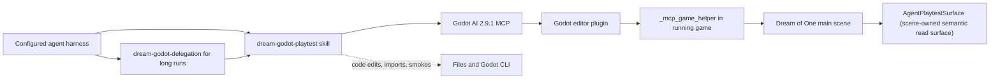

# Godot AI Inspection and Routed Play Control

**Status: foundation, delegated inspection, and hearing-capable M3R read surface
implemented (2026-07-13).** The vendored add-on, editor plugin/autoload, repository skills,
editor/server/game-helper path, and scene-owned `AgentPlaytestSurface` are
proven through native Godot AI calls. Hands-on M3R acceptance remains later
work, explicitly routed below.

## Reader job

An implementing agent should be able to inspect and debug the exact Godot
editor through Godot AI without macOS Computer Use. The separately designated
play executor should be able to drive final live acceptance through the same
surface, discovered from the repository skill, without reconstructing private
node paths or inventing a mutation shortcut.

## Intent

Dream of One will be inspected and, at routed acceptance points, played by AI
agents. Driving the window through accessibility coordinates is slow, hard to
reproduce, and poorly grounded in game state. The project therefore treats
[Godot AI](https://github.com/hi-godot/godot-ai) as a required development
integration and adds a small Dream-specific layer on top.

The target is an efficient live control surface, not a new automated testing
platform. Implementation agents inspect state, errors, and captures without
hands-on input; actual exploration and conversations occur only under the
executor/provider route in [`verification.md`](verification.md).

## Confirmed decisions

- Godot AI and the Dream-specific play surface run together; Godot AI is not an
  optional adapter or fallback.
- Vendor the owner-provided editor snapshot under `godot/addons/godot_ai/`,
  commit its MIT license, enable the plugin and game-helper autoload, and name
  the actual provenance: add-on commit `0ffbce6…`, plugin/server package 2.9.1.
- Use a mixture of the generic Godot AI tools and a thin project adapter. Do not
  force every action through one layer.
- Add a repository-local skill shared by Codex and Claude Code, plus this short
  technical source of truth.
- Route high-volume Godot AI work through one native in-session subagent so its
  run, MCP traffic, and evidence remain isolated. When native spawn has no model
  selector, the user-selected parent session owns the Sol-high/Terra-high lane;
  Terra high alone owns player input and gameplay capture.
- When the integration is unavailable, attempt bounded automatic recovery once,
  then report the blocker. Do not silently fall back to Computer Use.
- Use `godot-best-practice` as the engine-generic control and evidence contract.
- During M3R, every 3D spatial/UI slice uses the non-play implementation route:
  exact-session preflight, scene/Inspector inspection or mutation where
  appropriate, diagnostics, and a state-appropriate capture. Sol may run a
  fixture-mode helper handshake, but sends no player input and makes no gameplay
  model call. After implementation and self-review, the bounded executor packet
  assigns actual play to Terra high; all in-game model calls are Qwen live with
  zero fallback. The maintained command contract is
  [`verification.md`](verification.md).

## Non-goals

- No deterministic scenario language, golden transcript suite, coverage target,
  or fixture/live assertion matrix.
- No second MCP server, custom TCP bridge, browser dashboard, or remote network
  endpoint.
- No replacement for the existing Bun and Godot smokes in
  [`verification.md`](verification.md).
- No blanket requirement to generate every scene through MCP. Godot AI is
  required for live scene/Inspector work and evidence; files and the CLI remain
  preferred for code, bulk edits, import, and smokes.
- No debug command that changes suspicion, records, the civic ledger, verdicts,
  or session termination. The existing authority boundary remains intact.
- No committed machine-specific MCP client configuration, editor preferences,
  credentials, ports, or absolute Godot paths.
- No add-on or Python package upgrade beyond the pinned snapshot/package as part
  of the initial implementation.

## Current repository state

Verified on 2026-07-12 against Godot `4.7.stable.official.5b4e0cb0f`:

- `godot/addons/godot_ai/` uses the owner-provided upstream snapshot at commit
  `0ffbce6ef167e4f22e8d0674181ad06d9feeae79` as its baseline, plus the narrow
  committed-Unicode helper patch described below. `plugin.cfg` reports 2.9.1
  and the plugin spawns `godot-ai==2.9.1`; the upstream baseline itself is not
  byte-identical to tag `v2.9.1` (`6cdd3573…`). Three post-tag editor files
  differ before Dream's local patch, as recorded in the skill reference.
- `godot/project.godot` enables `res://addons/godot_ai/plugin.cfg` and registers
  `_mcp_game_helper="*res://addons/godot_ai/runtime/game_helper.gd"`.
- With telemetry disabled and `DREAM_SESSION_MODE=fixture`, the editor connected
  one exact project session, reported plugin/server 2.9.1 and
  `readiness=ready`, launched the main scene with `helper_live=true`, returned
  the game-helper boot log, and stopped cleanly without any player input or LLM
  call. The log contained pre-existing GDScript warnings but no launch/runtime
  error.
- Closing the probe-owned editor after plugin unload reported five leaked
  `ObjectDB` instances and two resources still in use. This did not affect the
  server/helper handshake or run stop, but remains a pinned-integration cleanup
  warning to recheck on upgrade; it is not hidden as a clean shutdown claim.
- A fresh native Codex subagent inherited the Godot AI tool surface after the
  server and editor were available. It selected the exact checkout session,
  launched a fixture-mode helper without player input, read the three
  `godot_ai_*` properties on `/Main3D/AgentPlaytestSurface`, observed six
  resident targets and no door targets, crossed the exact three-arrival replay
  packet without an error, and returned the editor to stopped/ready. The native
  spawn surface exposed no model/effort selector or worker identity, so its
  binding is recorded as inherited rather than independently verified. Claude
  Code execution remains untested, while its package discovery path is the
  tracked `.claude/skills` symlink.
- The stock 2.9.1 helper sends absolute mouse positions without relative
  motion, while the first-person controller correctly consumes logical motion;
  it also omits the Unicode field required for committed native-script text.
  Dream now derives a zero-relative synthetic look delta from consecutive
  absolute positions in `Player3D` and carries a one-character Unicode
  codepoint in the vendored helper's normal `Input.parse_input_event` path.
  `godot_ai_input_smoke.gd` protects both consequences without gameplay input
  or a provider call. The playtest snapshot also exposes run/presentation/next
  locale, deferred-language state, and UI scale for final locale evidence.
- Stopping the agent-owned editor also stopped an externally started server in
  one observed run. Treat editor and server lifetime as coupled unless current
  session status proves otherwise; after editor shutdown, restart the server
  before expecting a new harness to discover it.
- No port, editor preference, client configuration, credential, or absolute
  machine path is tracked.

## Architecture



The dependency direction is deliberate:

1. The repository skill owns task routing, safety, recovery, the non-play
   inspection path, and the authorized play loop.
2. Godot AI owns editor connection, project lifecycle, generic runtime input,
   logs, screenshots, runtime tree inspection, and bounded evaluation.
3. `AgentPlaytestSurface` owns only stable Dream-specific presentation state
   that would otherwise require repeated knowledge of private nodes.
4. The Godot client and NPC runtime continue to own the game. The play surface
   must not become an alternate game-state API.

## Control-surface routing

Use the smallest surface that answers the current question.

| Need | Preferred surface |
| --- | --- |
| Select the exact checkout and confirm editor readiness | Godot AI session/editor state |
| Run or stop for a non-play helper handshake | Godot AI project lifecycle; fixture mode, no input |
| Move, interact, choose, cancel, or open the log when the route authorizes play | Godot AI bounded input actions |
| Enter text into a focused field during authorized play | Godot AI keyboard/UI input; add a semantic helper only if real use proves this unreliable |
| See what the player sees | Godot AI running-game screenshot |
| Read parse, load, debugger, or runtime errors | Godot AI editor and game logs |
| Explore an unfamiliar node or UI | Godot AI runtime tree, node, and UI inspection |
| Read stable game-specific presentation state | Native runtime node read at `/Main3D/AgentPlaytestSurface`: `godot_ai_capabilities`, `godot_ai_snapshot`, `godot_ai_semantic_targets` |
| Add, reparent, configure, or connect scene-owned nodes | Godot AI scene/node/resource operations with undo and save; direct text editing only for small, fully understood serialized changes |
| Change GDScript or many text resources | Files and `apply_patch`; reload and inspect through Godot AI |
| Import, smoke, or CI-style checks | Godot CLI and existing scripts |

Generic Godot AI capability is the default for exploratory inspection or
authorized play. Promote an operation into the Dream adapter only when at
least one of these is true:

- agents repeatedly reconstruct the same private node traversal;
- a stable semantic read cannot be obtained from a bounded generic call;
- a routine interaction requires error-prone multi-call timing;
- a client refactor would otherwise break every agent play procedure.

Do not add a helper merely to shorten one MCP call.

## M3R implementation-time slice contract

For each 3D spatial/UI slice:

1. Enumerate sessions and match the canonical `godot/` root, then require the
   pinned versions, editor readiness, current scene, play state, and diagnostic
   cursor before the first stateful operation.
2. Keep code, data, bulk resource edits, import, and smokes in files/CLI. Use
   session-routed Godot AI operations for scene-owned structure and Inspector
   work where they give safer undo/save semantics.
3. After reload or import, inspect the saved hierarchy and relevant properties,
   read new editor/game errors, and capture the affected editor or game state
   when the slice makes a visual claim.
4. Launch the fixture helper only when runtime state is necessary; inspect it
   without input or a model call, then stop it.

Keep a bounded session/readiness check in the lead. When the work needs a run
lifecycle plus repeated runtime reads, logs, or captures, apply
`dream-godot-delegation`: one native worker spawned by the Sol-high parent owns
complex non-play inspection from preflight through stop. After implementation
and self-review, a separate native worker spawned by a Terra-high parent owns
every player-input or gameplay-acceptance run. Never run two workers against
the same editor.

After one bounded recovery, a missing integration blocks spatial/UI completion
and visual claims. It does not turn CLI checks into equivalent evidence.

## Thin Dream-specific adapter

### Placement

The default first-person scene `res://scenes/main_3d.tscn` owns a node named
`AgentPlaytestSurface` with
`res://scripts/testing/agent_playtest_surface.gd` attached. It is not present
in the retained 2D main scene and is not an autoload. The 3D main scene owns
the HUD, town, player, and presentation aliases, so this remains the narrowest
coherent lifetime.

The surface is available only in a debug run with an active engine debugger.
Outside that context it reports `available: false` and performs no work. It
must not open a socket, persist state, or run per-frame polling.

### Initial API

The landed first version is read-oriented:

```gdscript
func capabilities() -> Dictionary
func snapshot() -> Dictionary
func semantic_targets() -> Array[Dictionary]
```

Godot AI's runtime node inspector does not call those methods directly. The
surface therefore publishes the same copied values as debug-only, read-only,
non-storage properties:

| Property | Value |
| --- | --- |
| `godot_ai_capabilities` | Schema, available reads, and property names |
| `godot_ai_snapshot` | Current presentation snapshot |
| `godot_ai_semantic_targets` | Visible actor/prop target summaries |

Read them with the native runtime node-info operation at
`/Main3D/AgentPlaytestSurface`. They expose no `_set` path and no actions.

`capabilities()` returns the adapter schema version and supported reads.
`snapshot()` returns a JSON-safe presentation snapshot containing only fields
needed to play and debug:

- location id, run id, session mode, and world revision;
- whether the player exists, its world position, facing, input-enabled state,
  and focused interactable id/title when available;
- whether the game is transitioning or resolving an answer;
- visible modal surface: none, conversation, inspect, settings, or outcome;
- active turn id, beat id, speaker id, visible choices, and free-input support;
- HUD busy/thinking state and whether a hesitation timer is visible;
- encountered stance/institutional-pressure summaries and provider provenance
  already exposed by normal/debug UI;
- run status, hearing procedure/staging/retry state, terminal result, and the
  player-visible outcome summary. The outcome read includes the verdict,
  officer line, evidenced-vouch count, six attributed testimonies, recap
  entries, citation counts, fallback marker, and restart state.

`semantic_targets()` returns visible/interactable actor and spatial-prop ids,
titles, kinds, and world positions. It does not expose hidden NPC knowledge,
unreadable records, projected routes, or provider secrets.

The adapter must return copies, not references to mutable dictionaries. Missing
nodes produce explicit availability fields rather than runtime errors.

### Actions

The initial adapter does not duplicate movement, key presses, mouse input,
screenshots, or generic node inspection. Godot AI already owns those actions.

Dream adds only input-transport fidelity around that generic path: two
position-only mouse motions provide the fallback logical delta used by
`Player3D`, and a one-character key string carries its committed Unicode
codepoint. Neither path calls gameplay methods or mutates world truth. Direct
Unicode commitment is not OS IME preedit/commit evidence; final acceptance
must keep those claims distinct.

If direct use shows that focused Korean text entry or another routine operation
cannot be performed reliably through bounded Godot AI input, add one semantic
UI helper in a follow-up commit. It must exercise the same HUD signal path as a
player, never call the run/session sidecar or mutate backend-owned state
directly.

## Repository skills

The repository contains `.agents/skills/dream-godot-playtest/SKILL.md` and
`.agents/skills/dream-godot-delegation/SKILL.md`. Their shared frontmatter uses
only `name` and `description`; `.claude/skills` discovers the same packages
through the existing symlink.

The skill should trigger when the user asks an agent to play, playtest, operate,
or live-debug Dream of One, capture a runtime view, or reproduce a player-facing
Godot problem. It should not trigger for code-only client changes that do not
need a run; those remain under `dream-godot-client` and `godot-best-practice`.

Keep the portable core capability-based. Put the exact Godot AI 2.9.1 operation
mapping in `references/godot-ai-2.9.1.md`, because Codex and Claude Code may
expose different MCP namespaces for the same server operations.

The skill first reads this page plus `verification.md`, classifies the request
as read-only inspection, implementation-time non-play inspection, or explicitly
authorized play, then performs the matching branch. Every branch selects the
canonical project root and requires Godot 4.7 plus ready plugin/server 2.9.1.
The non-play branch may prove helper liveness but sends no input. The play
branch applies the executor/Qwen preflight before launch, uses bounded generic
input, checks semantic/log transitions, captures the exercised state, and
stops unless the user asked to leave it open.

Computer Use is not a fallback for this workflow. It remains available only if
the user explicitly asks to test OS-window behavior outside Godot AI's control
surface.

`dream-godot-delegation` triggers when a task would otherwise keep the lead in
a long MCP loop. It spawns one native subagent, gives that worker exclusive run
ownership, and requires a compact evidence return. The current native Codex
spawn surface passes Godot AI tools to a fresh worker but exposes no model or
effort selector/identity. Until that changes, choose Sol high or Terra high on
the parent session before spawning; never write a model name into the worker
prompt and treat it as proof. `codex exec`, another agent CLI, curl, and
screen-coordinate automation are not automatic fallbacks.

## Readiness and bounded recovery

Before the first stateful operation:

1. Resolve the repository root from Git, then match the connected editor
   session to that checkout's `godot/project.godot`. Do not select a session by
   folder name alone.
2. Require the pinned editor snapshot, plugin/server package 2.9.1, Godot
   4.7.x, editor readiness, and the expected `_mcp_game_helper` autoload.
3. If several sessions match ambiguously, stop and report them rather than
   changing the globally active editor by guesswork.

On failure, attempt one bounded recovery pass:

1. refresh Godot AI session/server status;
2. confirm the intended Godot editor is open on the correct project;
3. confirm the plugin is enabled and the MCP server is connected;
4. if the project is stuck in `launching`, poll once within the documented
   readiness window;
5. if it is in debugger `break`, read editor/game diagnostics, stop the broken
   run, and relaunch once only when no code change is needed;
6. if the helper is missing or stale, stop and relaunch the game once after
   confirming the autoload entry.

If the same prerequisite is still absent, report the exact layer and evidence.
Do not reinstall the plugin, rewrite client configuration, restart a user-owned
editor, or use Computer Use without separate authority.

## Security and authority

- Godot AI is a development dependency. Do not expose its server outside
  loopback or include it in release-support promises.
- Disable Godot AI telemetry for agent-launched editor sessions. Keep that
  environment or editor preference per-device and out of the repository.
- Runtime evaluation executes project code. Prefer typed/bounded operations;
  use evaluation only in this trusted checkout and only when narrower reads are
  insufficient.
- A review or status request permits reads only. A build/change request permits
  in-scope editor changes and the non-play helper handshake. Hands-on game
  input requires the separate current executor route.
- Never use editor property mutation or runtime evaluation to manufacture the
  state that a gameplay claim is supposed to prove.
- Do not print or store provider credentials. The play surface reports session
  mode and fallback metadata only where the existing UI already exposes them.
- Preserve unrelated worktree changes. In particular, the initial Godot AI
  files and `project.godot` edit originated from the user and must be reviewed
  and committed intentionally, not regenerated.

## Implementation slices

### Slice 1 — Pin Godot AI foundation — complete 2026-07-12

- Verify `plugin.cfg` and server package report 2.9.1; compare and pin the
  vendored tree to its actual upstream commit rather than the nearby tag.
- Search the addon for credentials, generated caches, absolute paths, and local
  client configuration; exclude any such state.
- Track `godot/addons/godot_ai/`, its MIT license, and only the required
  `project.godot` plugin/autoload entries.
- Open/import with the pinned Godot 4.7 binary, require a ready plugin/server,
  and confirm the game helper becomes live on project run.

### Slice 2 — Add the portable repository skills — complete 2026-07-12

- Create `dream-godot-playtest` and the Godot AI 2.9.1 capability reference.
- Create `dream-godot-delegation` for native worker spawning, exclusive run
  ownership, parent-session model routing, and compact evidence return.
- Update `.agents/skills/README.md`.
- Validate frontmatter, links, positive triggers, and adjacent non-triggers.
- Exercise the same basic workflow in Codex and Claude Code when both clients
  are available; record an unavailable cell rather than extrapolating.

### Slice 3 — Add `AgentPlaytestSurface` — complete 2026-07-12

- Added the scene-owned debug-only read surface and initial API above to
  `main_3d.tscn`.
- Keep all game truth in the run/session runtime layers.
- Parsed/imported the script, loaded the 3D scene, and read a valid fixture-mode
  snapshot plus semantic targets through native Godot AI calls.
- Do not use generic input in the implementation slice. Final routed play proves
  the snapshot changes without an alternate mutation API.

### Slice 4 — Prove the direct-play loop — final routed Terra/Qwen run

After all M3R implementation and Sol self-review, issue the bounded executor
packet from `verification.md`. From a fresh Terra-high session with the
repository skill active and Qwen live/zero-fallback preflight passed:

1. select the exact editor session;
2. launch the main project and reach `live` helper status;
3. read the initial game state and screenshot;
4. move the player with bounded input;
5. focus and interact with an NPC;
6. submit at least one displayed choice and, if reliable through the generic
   input surface, one typed response;
7. observe the thinking state and next player-visible response;
8. inspect new game/editor logs and capture the exercised state;
9. stop the game cleanly.

The proof is the successful live workflow plus screenshots/log state, not a new
standing report file.

## Completion bars

The integration foundation implemented by slices 1–3 is complete when:

- the pinned editor snapshot, Python server package 2.9.1, MIT license, and
  required project settings are tracked with no
  machine-specific configuration or secrets.
- `dream-godot-playtest` and `dream-godot-delegation` are present in the shared
  canonical skill package; Codex native discovery and Claude execution are
  reported as tested or explicitly unavailable rather than inferred.
- the exact editor/server/helper handshake succeeds in fixture mode without
  input and returns to stopped/ready.
- a disconnected or broken integration receives at most one safe recovery pass
  and then an explicit blocker report.
- Existing Bun checks and Godot import/scene/route/localization/asset smokes stay
  green.
- Normal non-editor launch remains provider-first and the client/runtime
  authority boundary is unchanged.

The full M3R play surface is complete later when the adapter exposes the
finished run-backed conversation/hearing surfaces and the bounded Terra/Qwen
direct-play loop passes without Computer Use or an alternate state mutation
path.

## Risks and revisit rules

- **Plugin drift:** use editor commit `0ffbce6…` and server package 2.9.1 as
  the upstream baseline plus the tracked one-character Unicode helper patch.
  Upgrade either only in a dedicated change that rechecks compatibility,
  reapplies or removes that patch deliberately, and verifies the tool mapping,
  live helper, skill reference, input smoke, and routed direct-play loop.
- **Skill drift:** the technical doc owns project semantics; the skill routes to
  it. Do not copy volatile node paths into both.
- **Adapter growth:** when an action helper is proposed, require evidence that
  bounded generic input failed or repeated boilerplate became a real cost.
- **False playable proof:** a successful MCP response does not prove the player
  saw the intended result. Inspect the resulting state or capture.
- **Editor dependence:** Godot AI is intentionally required for this workflow.
  File/CLI checks may still diagnose code, but a missing live integration blocks
  direct-play and visual claims.
- **Editor/server lifetime:** plugin unload stopped an externally started
  server once during implementation. Recheck server status after every editor
  exit; a new editor does not imply an already discoverable MCP server.
- **Editor-exit cleanup:** the verified 2.9.1 combination reports leaked
  objects/resources after plugin unload on this Godot 4.7 build. It is nonfatal
  in the proven workflow; revisit if it grows, affects editor restart, or the
  pinned add-on/server combination changes.
- **Telemetry default:** the add-on enables telemetry unless the environment or
  per-device editor setting disables it. Automated project sessions must opt
  out without committing machine configuration.
