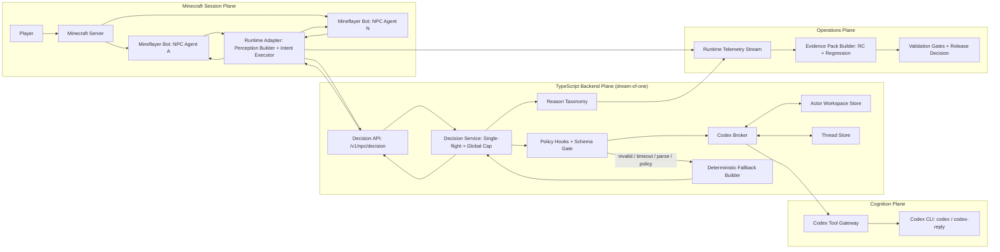
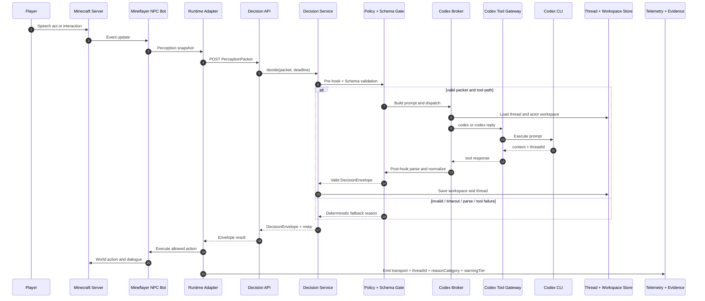
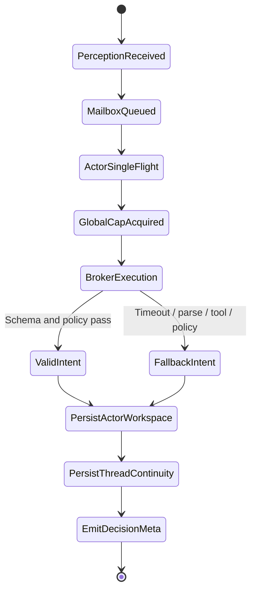
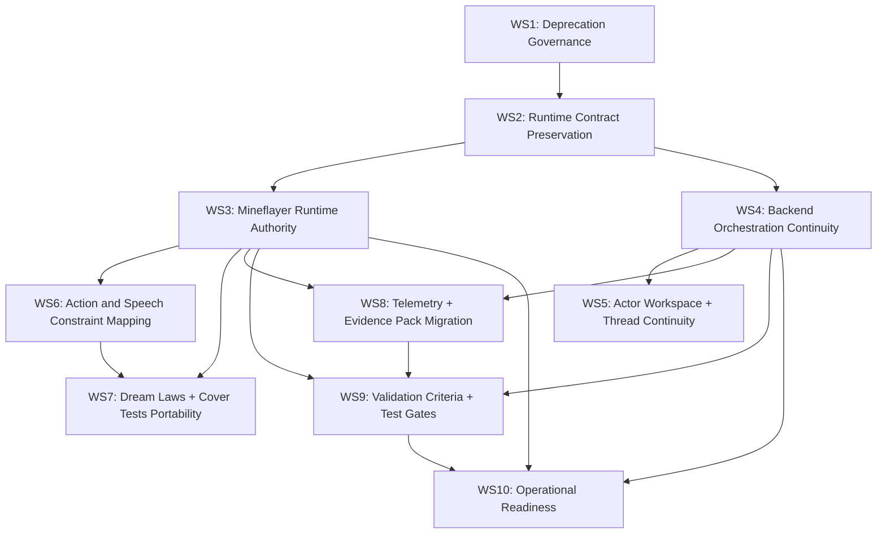

# Mineflayer Runtime Architecture (Based on `plan.md`)

## 1) System Architecture

```mermaid
flowchart LR
  subgraph GameplayPlane["Minecraft Session Plane"]
    Player["Player"]
    McServer["Minecraft Server"]
    BotA["Mineflayer Bot: NPC Agent A"]
    BotN["Mineflayer Bot: NPC Agent N"]
    Adapter["Runtime Adapter: Perception Builder + Intent Executor"]
  end

  subgraph RuntimePlane["TypeScript Backend Plane (dream-of-one)"]
    Http["Decision API: /v1/npc/decision"]
    Decision["Decision Service: Single-flight + Global Cap"]
    Policy["Policy Hooks + Schema Gate"]
    Broker["Codex Broker"]
    Taxonomy["Reason Taxonomy"]
    Fallback["Deterministic Fallback Builder"]
    Workspace["Actor Workspace Store"]
    Thread["Thread Store"]
  end

  subgraph CognitionPlane["Cognition Plane"]
    Gateway["Codex Tool Gateway"]
    Codex["Codex CLI: codex / codex-reply"]
  end

  subgraph OpsPlane["Operations Plane"]
    Telemetry["Runtime Telemetry Stream"]
    Evidence["Evidence Pack Builder: RC + Regression"]
    Release["Validation Gates + Release Decision"]
  end

  Player --> McServer
  McServer --> BotA
  McServer --> BotN
  BotA --> Adapter
  BotN --> Adapter
  Adapter --> Http
  Http --> Decision
  Decision --> Policy
  Policy --> Broker
  Broker --> Gateway
  Gateway --> Codex
  Broker <--> Workspace
  Broker <--> Thread
  Decision --> Taxonomy
  Policy -->|invalid / timeout / parse / policy| Fallback
  Fallback --> Decision
  Decision --> Http
  Http --> Adapter
  Adapter --> BotA
  Adapter --> BotN
  Adapter --> Telemetry
  Taxonomy --> Telemetry
  Telemetry --> Evidence
  Evidence --> Release
```

## 2) Runtime Path Sequence

```mermaid
sequenceDiagram
  autonumber
  participant Player as Player
  participant Server as Minecraft Server
  participant Bot as Mineflayer NPC Bot
  participant Adapter as Runtime Adapter
  participant API as Decision API
  participant Service as Decision Service
  participant Gate as Policy + Schema Gate
  participant Broker as Codex Broker
  participant Gateway as Codex Tool Gateway
  participant Codex as Codex CLI
  participant Store as Thread + Workspace Store
  participant Obs as Telemetry + Evidence

  Player->>Server: Speech act or interaction
  Server->>Bot: Event update
  Bot->>Adapter: Perception snapshot
  Adapter->>API: POST PerceptionPacket
  API->>Service: decide(packet, deadline)
  Service->>Gate: Pre-hook + Schema validation

  alt valid packet and tool path
    Gate->>Broker: Build prompt and dispatch
    Broker->>Store: Load thread and actor workspace
    Broker->>Gateway: codex or codex-reply
    Gateway->>Codex: Execute prompt
    Codex-->>Gateway: content + threadId
    Gateway-->>Broker: tool response
    Broker->>Gate: Post-hook parse and normalize
    Gate-->>Service: Valid DecisionEnvelope
    Service->>Store: Save workspace and thread
  else invalid / timeout / parse / tool failure
    Gate-->>Service: Deterministic fallback reason
  end

  Service-->>API: DecisionEnvelope + meta
  API-->>Adapter: Envelope result
  Adapter->>Bot: Execute allowed action
  Bot->>Server: World action and dialogue
  Adapter->>Obs: Emit transport + threadId + reasonCategory + warningTier
```

## 3) Actor Decision Lifecycle

```mermaid
stateDiagram-v2
  [*] --> PerceptionReceived
  PerceptionReceived --> MailboxQueued
  MailboxQueued --> ActorSingleFlight
  ActorSingleFlight --> GlobalCapAcquired
  GlobalCapAcquired --> BrokerExecution

  BrokerExecution --> ValidIntent: Schema and policy pass
  BrokerExecution --> FallbackIntent: Timeout / parse / tool / policy

  ValidIntent --> PersistActorWorkspace
  FallbackIntent --> PersistActorWorkspace
  PersistActorWorkspace --> PersistThreadContinuity
  PersistThreadContinuity --> EmitDecisionMeta
  EmitDecisionMeta --> [*]
```

## 4) Workstream Dependency Architecture

```mermaid
flowchart TD
  WS1["WS1: Deprecation Governance"]
  WS2["WS2: Runtime Contract Preservation"]
  WS3["WS3: Mineflayer Runtime Authority"]
  WS4["WS4: Backend Orchestration Continuity"]
  WS5["WS5: Actor Workspace + Thread Continuity"]
  WS6["WS6: Action and Speech Constraint Mapping"]
  WS7["WS7: Dream Laws + Cover Tests Portability"]
  WS8["WS8: Telemetry + Evidence Pack Migration"]
  WS9["WS9: Validation Criteria + Test Gates"]
  WS10["WS10: Operational Readiness"]

  WS1 --> WS2
  WS2 --> WS3
  WS2 --> WS4
  WS4 --> WS5
  WS3 --> WS6
  WS3 --> WS7
  WS6 --> WS7
  WS3 --> WS8
  WS4 --> WS8
  WS3 --> WS9
  WS4 --> WS9
  WS8 --> WS9
  WS3 --> WS10
  WS4 --> WS10
  WS9 --> WS10
```
