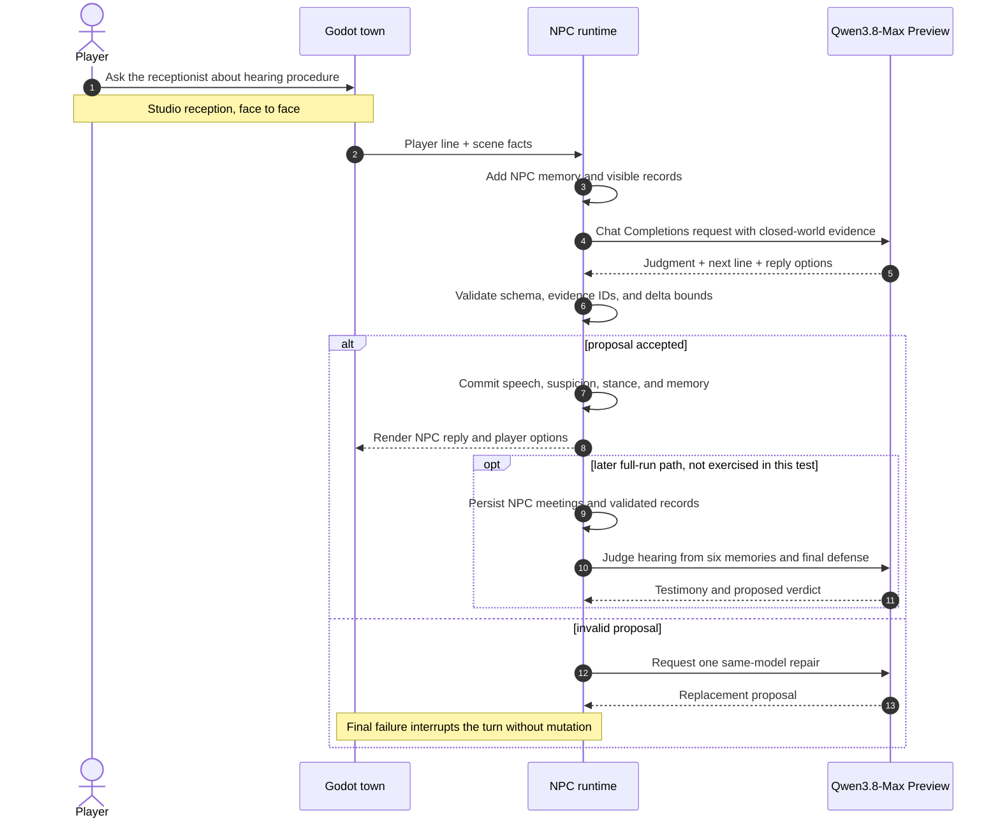

I connected `qwen3.8-max-preview` to Dream of One's production NPC runtime and
ran a real Korean conversation turn. The final run completed two live model
calls, charged 15,498 tokens, required no schema repair or fallback, and passed
the runtime's grounding, locale, and audit checks.

This post covers the integration and the observed result. It does not treat a
provider call as proof of a finished game.

<!-- truncate -->


*The current Godot prototype running with its English presentation locale.
The Qwen3.8 run reused its Studio receptionist contract without claiming this
rendered route as Qwen3.8 play evidence.*


*The English UI used for these public captures. The provider-contract test
below intentionally ran in Korean to exercise locale validation.*

## The job I gave Qwen

Dream of One is a first-person social simulation. Six residents move through a
small town, meet one another, remember encountered speech, and testify at a
scheduled hearing about the player.

The language model owns social meaning:

- what an NPC says;
- how the NPC reads the player's answer;
- whether suspicion or stance should move;
- what the NPC asks or does next.

The TypeScript runtime owns validity. It limits each NPC to visible and
remembered evidence, validates every proposed tool call, clamps numeric
changes, and rejects invented world mutations. A model response only enters
the game after it passes that boundary.

For this test, Qwen acted as the Studio receptionist. The scene stated that
the visitor and receptionist were face to face. It also stated that the
visitor had not established an appointment, booking, document, or previous
action. This made factual restraint part of the test.

## How I connected it

Dream of One already routes all model work through `NpcProposalPort` and a
Chat Completions adapter. I added an opt-in profile rather than placing an
Alibaba call in game logic:



```json
{
  "adapter": "chat-completions",
  "baseUrlEnv": "MODEL_STUDIO_BASE_URL",
  "apiKeyEnv": "MODEL_STUDIO_API_KEY",
  "model": "qwen3.8-max-preview",
  "timeoutMs": 180000,
  "params": {
    "temperature": 0.7,
    "maxTokens": 1600
  },
  "structured": "json-instructed"
}
```

The endpoint is scoped to an Alibaba Model Studio workspace. The workspace id
and key stay in local environment variables:

```bash
export MODEL_STUDIO_BASE_URL="https://${MODEL_STUDIO_WORKSPACE_ID}.ap-southeast-1.maas.aliyuncs.com/compatible-mode/v1"
export NPC_PROVIDER_PROFILE="alibaba-model-studio/qwen3.8-max-preview"
```

I also changed the existing provider smoke so that `--profile` becomes the
profile it verifies. Previously the tool could select another profile but
still compared every result with the project's Qwen3.7 acceptance profile.
The production default and that separate milestone route remain unchanged.

## The first request failed

The first Model Studio request ended with `transport_error`. It carried
`chat_template_kwargs.enable_thinking=false`, a request field used by the
existing ModelScope profile.

The known-good Model Studio adapter in a sibling experiment omitted that
field. I made the same narrow change and left Qwen3.8-Max Preview on its
provider-default reasoning behavior. The next run passed. The evidence shows
that the request-shape change fixed this route; it does not expose a detailed
server error proving why the first request was rejected.

## The live conversation

The live calls used the `ko-KR` locale. I translated the three lines below
into English for this post while keeping the original locale and audit totals
in the recorded result.

The first call asked Qwen for the grounded opening. It returned:

> Hello, this is the Studio reception desk. Could you first tell me what
> brings you here?

The player answered:

> I came to check what procedures I need to follow before the hearing.

The second call performed a merged operation. Qwen judged the answer and wrote
the next NPC line in one response. Its social judgment was:

| Field | Qwen result |
| --- | --- |
| Suspicion delta | `0` |
| Report-pressure delta | `+3` |
| Stance | `uncertain` |
| Meaningful first-hand contact | `true` |
| Conversation continues | `true` |

Qwen's next line was:

> I see. You are here to check the procedure before the hearing. Could you
> tell me whether you want general reception guidance or whether you are
> asking about an appointment that has already been scheduled?

The response recognized the player's stated purpose without asserting that an
appointment or document existed. It kept the receptionist uncertain, treated
the exchange as meaningful first-hand contact, and continued with a
clarifying question.

## The recorded result

| Evidence | Observed value |
| --- | --- |
| Exact profile | `alibaba-model-studio/qwen3.8-max-preview` |
| Locale | `ko-KR` |
| Operations | conversation opening, merged judgment and reply |
| Physical calls | 2 |
| Successful calls | 2 |
| Charged tokens | 15,498 |
| Schema repair calls | 0 |
| Fallback calls | 0 |
| Audit | complete and untruncated |
| Dropped or in-flight work | 0 |

Both resolutions reported `transport=live` and the exact Qwen3.8-Max Preview
profile. The runtime accepted the Korean writing-system checks, the
request-scoped evidence ids, the reply-suggestion schema, the judgment bounds,
and the provider accounting. Scripted output did not supply any NPC wording or
social judgment.

## What I learned

The useful result is larger than “the API returned text.” Qwen produced two
linked outputs inside a closed-world social contract: an opening that did not
invent visitor history, then a judgment and follow-up that stayed consistent
with the player's actual statement. The deterministic runtime could accept
both without repair.

The run also exposed the cost of reasoning-heavy structured output. A short
visible exchange consumed 15,498 charged tokens. A full Dream of One session
includes background NPC decisions, resident meetings, player conversations,
and six hearing testimonies, so token use needs measurement before this model
becomes a full-run profile.

This was a live provider-contract test. I have not yet used Qwen3.8-Max Preview
for a rendered five-minute Godot route, an NPC-to-NPC meeting, or the Station
hearing. Those are the next tests needed to judge play quality, long-run cost,
and whether the model preserves social continuity across the whole town.
